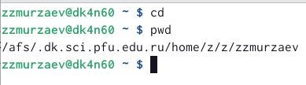
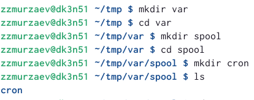
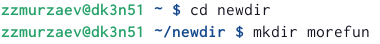
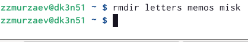
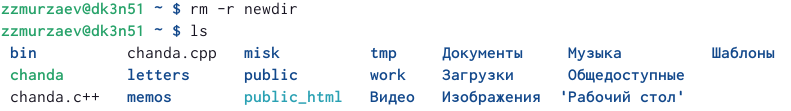
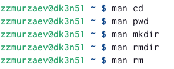

---
## Front matter
lang: ru-RU
title: Презентация по лабораторной работе
subtitle: Лабораторная работа номер 4.
author:
  - Мурзаев Замир Зейнадинович
institute:
  - Российский университет дружбы народов, Москва, Россия
  - Объединённый институт ядерных исследований, Дубна, Россия
date: 31 января 2002 года

## i18n babel
babel-lang: russian
babel-otherlangs: english

## Formatting pdf
toc: false
toc-title: Содержание
slide_level: 2
aspectratio: 169
section-titles: true
theme: metropolis
header-includes:
 - \metroset{progressbar=frametitle,sectionpage=progressbar,numbering=fraction}
 - '\makeatletter'
 - '\beamer@ignorenonframefalse'
 - '\makeatother'
---

# Информация

## Докладчик

:::::::::::::: {.columns align=center}
::: {.column width="70%"}

  * Мурзаев Замир Зейнадинович
  * студент НБИбд-02-22
  * просто красавчик по жизни
  * Российский университет дружбы народов
  * [1132222002@pfur.ru](mailto:kulyabov-ds@rudn.ru)
  * <https://yamadharma.github.io/ru/>

:::
::: {.column width="30%"}


:::
::::::::::::::

# Вводная часть

## Актуальность

- Для продвинутого пользования компьютером нужны умения пользования им при помощи командной строки.


## Объект и предмет исследования

- Командная строка, ее команды и опции.

## Цели и задачи

- Приобретение практических навыков взаимодействия пользователя с системой посредством командной строки.

# Выполнение лабораторной работы

## 1)Определяем имя нашего домашнего каталога 

{#fig:001 width=90%}

## 2)Переходим в каталог tmp 

{#fig:002 width=90%}

## Смотрим содержание данного каталога. Опция -а используется для показа файлов, которые скрыты 

{#fig:003 width=90%}

## Смотрим, есть ли в кталоге var/spoon/ каталог с именем cron 

{#fig:004 width=90%}

## Переходим в домашний каталог и показываем его содержимое, владельцем каталогов является zzmurzaev 

{#fig:005 width=90%}

## 3)В домашнем каталоге создаем новый подкаталог 

{#fig:006 width=90%}

## В новом каталоге создаем еще один новый каталог 

{#fig:007 width=90%}

## Создаем три каталог с помощью mkdir, а затем одной командой всех их удаляем 

{#fig:008 width=90%}

## Удаляем каталог newdir и его подкаталоги, потом проверяем, удален ли каталог 

{#fig:009 width=90%}

## 4-6) Команда man позволяет узнать подробнее о других командах, узнать, какие у этой команды есть опции (рис. @fig:010) 

{#fig:010 width=90%}

{#fig:011 width=90%}

## 7)Команда history раскрывает список команд, которые были выполнены в обратном хронологическом порядке 

{#fig:011 width=90%}

## Вывод

Я получил практические навыки пользования командной строкой.


## Материалы и методы

- Процессор `pandoc` для входного формата Markdown
- Результирующие форматы
	- `pdf`
	- `html`
- Автоматизация процесса создания: `Makefile`

# Создание презентации

## Процессор `pandoc`

- Pandoc: преобразователь текстовых файлов
- Сайт: <https://pandoc.org/>
- Репозиторий: <https://github.com/jgm/pandoc>

## Формат `pdf`

- Использование LaTeX
- Пакет для презентации: [beamer](https://ctan.org/pkg/beamer)
- Тема оформления: `metropolis`

## Код для формата `pdf`

```yaml
slide_level: 2
aspectratio: 169
section-titles: true
theme: metropolis
```

## Формат `html`

- Используется фреймворк [reveal.js](https://revealjs.com/)
- Используется [тема](https://revealjs.com/themes/) `beige`

## Код для формата `html`

- Тема задаётся в файле `Makefile`

```make
REVEALJS_THEME = beige 
```
# Результаты

## Получающиеся форматы

- Полученный `pdf`-файл можно демонстрировать в любой программе просмотра `pdf`
- Полученный `html`-файл содержит в себе все ресурсы: изображения, css, скрипты

# Элементы презентации

## Актуальность

- Даёт понять, о чём пойдёт речь
- Следует широко и кратко описать проблему
- Мотивировать свое исследование
- Сформулировать цели и задачи
- Возможна формулировка ожидаемых результатов

## Цели и задачи

- Не формулируйте более 1--2 целей исследования

## Материалы и методы

- Представляйте данные качественно
- Количественно, только если крайне необходимо
- Излишние детали не нужны

## Содержание исследования

- Предлагаемое решение задач исследования с обоснованием
- Основные этапы работы

## Результаты

- Не нужны все результаты
- Необходимы логические связки между слайдами
- Необходимо показать понимание материала


## Итоговый слайд

- Запоминается последняя фраза. © Штирлиц
- Главное сообщение, которое вы хотите донести до слушателей
- Избегайте использовать последний слайд вида *Спасибо за внимание*

# Рекомендации

## Принцип 10/20/30

  - 10 слайдов
  - 20 минут на доклад
  - 30 кегль шрифта

## Связь слайдов

::: incremental

- Один слайд --- одна мысль
- Нельзя ссылаться на объекты, находящиеся на предыдущих слайдах (например, на формулы)
- Каждый слайд должен иметь заголовок

:::

## Количество сущностей

::: incremental

- Человек может одновременно помнить $7 \pm 2$ элемента
- При размещении информации на слайде старайтесь чтобы в сумме слайд содержал не более 5 элементов
- Можно группировать элементы так, чтобы визуально было не более 5 групп

:::

## Общие рекомендации

::: incremental

- На слайд выносится та информация, которая без зрительной опоры воспринимается хуже
- Слайды должны дополнять или обобщать содержание выступления или его частей, а не дублировать его
- Информация на слайдах должна быть изложена кратко, чётко и хорошо структурирована
- Слайд не должен быть перегружен графическими изображениями и текстом
- Не злоупотребляйте анимацией и переходами

:::

## Представление данных

::: incremental

- Лучше представить в виде схемы
- Менее оптимально представить в виде рисунка, графика, таблицы
- Текст используется, если все предыдущие способы отображения информации не подошли

:::

