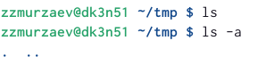
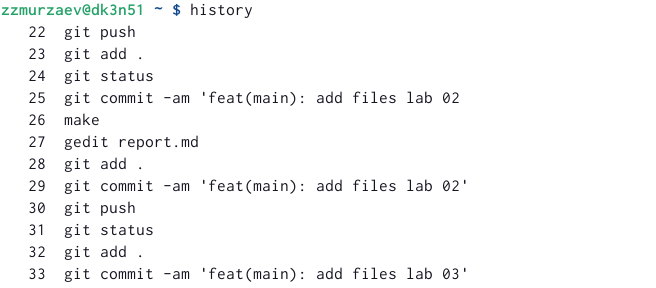

---
## Front matter
title: "Отчёт по лабораторной работе"
subtitle: "Лабораторная работа № 4"
author: Мурзаев Замир Зейнадинович

## Generic otions
lang: ru-RU
toc-title: "Содержание"

## Bibliography
bibliography: bib/cite.bib
csl: pandoc/csl/gost-r-7-0-5-2008-numeric.csl

## Pdf output format
toc: true # Table of contents
toc-depth: 2
lof: true # List of figures
lot: true # List of tables
fontsize: 12pt
linestretch: 1.5
papersize: a4
documentclass: scrreprt
## I18n polyglossia
polyglossia-lang:
  name: russian
  options:
	- spelling=modern
	- babelshorthands=true
polyglossia-otherlangs:
  name: english
## I18n babel
babel-lang: russian
babel-otherlangs: english
## Fonts
mainfont: PT Serif
romanfont: PT Serif
sansfont: PT Sans
monofont: PT Mono
mainfontoptions: Ligatures=TeX
romanfontoptions: Ligatures=TeX
sansfontoptions: Ligatures=TeX,Scale=MatchLowercase
monofontoptions: Scale=MatchLowercase,Scale=0.9
## Biblatex
biblatex: true
biblio-style: "gost-numeric"
biblatexoptions:
  - parentracker=true
  - backend=biber
  - hyperref=auto
  - language=auto
  - autolang=other*
  - citestyle=gost-numeric
## Pandoc-crossref LaTeX customization
figureTitle: "Рис."
tableTitle: "Таблица"
listingTitle: "Листинг"
lofTitle: "Список иллюстраций"
lotTitle: "Список таблиц"
lolTitle: "Листинги"
## Misc options
indent: true
header-includes:
  - \usepackage{indentfirst}
  - \usepackage{float} # keep figures where there are in the text
  - \floatplacement{figure}{H} # keep figures where there are in the text
---

# Цель работы

Целью работы является приобретение практических навыков взаимодействия пользователя с системой посредством командной строки.

# Задание

1. Определите полное имя вашего домашнего каталога. Далее относительно этого ката-
лога будут выполняться последующие упражнения.
2. Выполните следующие действия:
2.1. Перейдите в каталог /tmp.
2.2. Выведите на экран содержимое каталога /tmp. Для этого используйте команду ls
с различными опциями. Поясните разницу в выводимой на экран информации.
2.3. Определите, есть ли в каталоге /var/spool подкаталог с именем cron?
2.4. Перейдите в Ваш домашний каталог и выведите на экран его содержимое. Опре-
делите, кто является владельцем файлов и подкаталогов?
3. Выполните следующие действия:
3.1. В домашнем каталоге создайте новый каталог с именем newdir.
3.2. В каталоге ~/newdir создайте новый каталог с именем morefun.
3.3. В домашнем каталоге создайте одной командой три новых каталога с именами
letters, memos, misk. Затем удалите эти каталоги одной командой.
3.4. Попробуйте удалить ранее созданный каталог ~/newdir командой rm. Проверьте,
был ли каталог удалён.
3.5. Удалите каталог ~/newdir/morefun из домашнего каталога. Проверьте, был ли
каталог удалён.
4. С помощью команды man определите, какую опцию команды ls нужно использо-
вать для просмотра содержимое не только указанного каталога, но и подкаталогов,
входящих в него.
5. С помощью команды man определите набор опций команды ls, позволяющий отсорти-
ровать по времени последнего изменения выводимый список содержимого каталога
с развёрнутым описанием файлов.
6. Используйте команду man для просмотра описания следующих команд: cd, pwd, mkdir,
rmdir, rm. Поясните основные опции этих команд.
7. Используя информацию, полученную при помощи команды history, выполните мо-
дификацию и исполнение нескольких команд из буфера команд.

# Теоретическое введение

Команда man. Команда man используется для просмотра (оперативная помощь) в диа-
логовом режиме руководства (manual) по основным командам операционной системы
типа Linux.

Команда cd. Команда cd используется для перемещения по файловой системе опера-
ционной системы типа Linux.

Команда pwd. Для определения абсолютного пути к текущему каталогу используется
команда pwd (print working directory).

Команда ls. Команда ls используется для просмотра содержимого каталога.

Команда mkdir. Команда mkdir используется для создания каталогов.

Команда rm. Команда rm используется для удаления файлов и/или каталогов.

Команда history. Для вывода на экран списка ранее выполненных команд исполь-
зуется команда history. Выводимые на экран команды в списке нумеруются. К любой
команде из выведенного на экран списка можно обратиться по её номеру в списке,
воспользовавшись конструкцией !<номер_команды>.

# Выполнение лабораторной работы

1)Определяем имя нашего домашнего каталога (рис. @fig:001).

{#fig:001 width=90%}

2)Переходим в каталог tmp (рис. @fig:002).

{#fig:002 width=90%}

Смотрим содержание данного каталога. Опция -а используется для показа файлов, которые скрыты (рис. @fig:003).

{#fig:003 width=90%}

Смотрим, есть ли в кталоге var/spoon/ каталог с именем cron (рис. @fig:004).

{#fig:004 width=90%}

Переходим в домашний каталог и показываем его содержимое, владельцем каталогов является zzmurzaev (рис. @fig:005).

{#fig:005 width=90%}

3)В домашнем каталоге создаем новый подкаталог (рис. @fig:006).

{#fig:006 width=90%}

В новом каталоге создаем еще один новый каталог (рис. @fig:007).

{#fig:007 width=90%}

Создаем три каталог с помощью mkdir, а затем одной командой всех их удаляем (рис. @fig:008).

{#fig:008 width=90%}

Удаляем каталог newdir и его подкаталоги, потом проверяем, удален ли каталог (рис. @fig:009).

{#fig:009 width=90%}

4-6) Команда man позволяет узнать подробнее о других командах, узнать, какие у этой команды есть опции (рис. @fig:010) (рис. @fig:011).

{#fig:010 width=90%}

{#fig:011 width=90%}

7)Команда history раскрывает список команд, которые были выполнены в обратном хронологическом порядке (рис. @fig:012).

{#fig:011 width=90%}

# Выводы

Здесь кратко описываются итоги проделанной работы.

# Список литературы{.unnumbered}

::: {#refs}
:::
