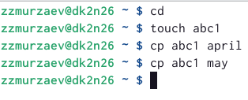
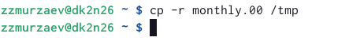
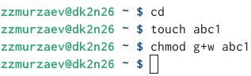
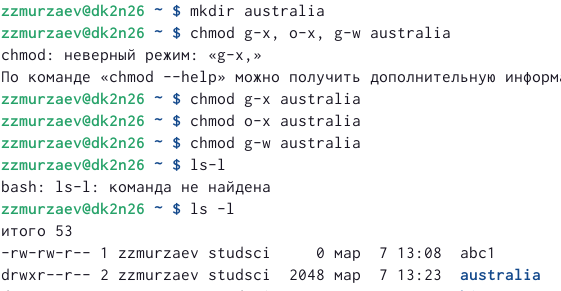
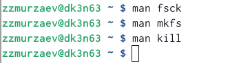

---
## Front matter
lang: ru-RU
title: Презентация лабораторной работы
subtitle: Лабораторная работа № 5
author:
  - Мурзаев З.З.
institute:
  - Российский университет дружбы народов, Москва, Россия
  - Дагестанский Государственный Университет Народного Хозяйства, Махачкала, Россия
date: 31 января 2002

## i18n babel
babel-lang: russian
babel-otherlangs: english

## Formatting pdf
toc: false
toc-title: Содержание
slide_level: 2
aspectratio: 169
section-titles: true
theme: metropolis
header-includes:
 - \metroset{progressbar=frametitle,sectionpage=progressbar,numbering=fraction}
 - '\makeatletter'
 - '\beamer@ignorenonframefalse'
 - '\makeatother'
---

# Информация

## Докладчик

:::::::::::::: {.columns align=center}
::: {.column width="70%"}

  * Кулябов Дмитрий Сергеевич
  * студент НБИбд-02-22


:::
::: {.column width="30%"}


:::
::::::::::::::

# Вводная часть

## Актуальность

- Ознакомление с файловой системой Linux, её структурой, именами и содержанием
каталогов. 
- Приобретение практических навыков по применению команд для работы
с файлами и каталогами, по управлению процессами (и работами), по проверке исполь-
зования диска и обслуживанию файловой системы.


## Объект и предмет исследования

- Файловая система Linux
- Команда для работы с файлами и каталогами

## Цели и задачи

- Ознакомление с файловой системой Linux, её структурой, именами и содержанием
каталогов. 
- Приобретение практических навыков по применению команд для работы
с файлами и каталогами, по управлению процессами (и работами), по проверке исполь-
зования диска и обслуживанию файловой системы.


## Материалы и методы

- Процессор `pandoc` для входного формата Markdown
- Результирующие форматы
	- `pdf`
	- `html`
- Автоматизация процесса создания: `Makefile`

# Создание презентации

## Процессор `pandoc`

- Pandoc: преобразователь текстовых файлов
- Сайт: <https://pandoc.org/>
- Репозиторий: <https://github.com/jgm/pandoc>

## Формат `pdf`

- Использование LaTeX
- Пакет для презентации: [beamer](https://ctan.org/pkg/beamer)
- Тема оформления: `metropolis`

## Код для формата `pdf`

```yaml
slide_level: 2
aspectratio: 169
section-titles: true
theme: metropolis
```

## Формат `html`

- Используется фреймворк [reveal.js](https://revealjs.com/)
- Используется [тема](https://revealjs.com/themes/) `beige`

## Код для формата `html`

- Тема задаётся в файле `Makefile`

```make
REVEALJS_THEME = beige 
```
# Результаты

## Получающиеся форматы

- Полученный `pdf`-файл можно демонстрировать в любой программе просмотра `pdf`
- Полученный `html`-файл содержит в себе все ресурсы: изображения, css, скрипты

# Элементы презентации

## Актуальность

- Даёт понять, о чём пойдёт речь
- Следует широко и кратко описать проблему
- Мотивировать свое исследование
- Сформулировать цели и задачи
- Возможна формулировка ожидаемых результатов

## Цели и задачи

- Не формулируйте более 1--2 целей исследования

## Материалы и методы

- Представляйте данные качественно
- Количественно, только если крайне необходимо
- Излишние детали не нужны

## Содержание исследования

# Выполнение лабораторной работы

## 1)Копирование файла в текущем каталоге (рис. @fig:001).

{#fig:001 width=90%}

## Копирование нескольких файлов в каталог (рис. @fig:002).

{#fig:002 width=90%}
 
## Копирование файлов в произвольном каталоге.(рис. @fig:003).
 
{#fig:003 width=90%}

## Копирование каталогов в текущем каталоге. Скопировать каталог monthly в каталог
monthly.00: (рис. @fig:004).

{#fig:004 width=90%}

## Копирование каталогов в произвольном каталоге (рис. @fig:005).

{#fig:005 width=90%}

## Переименование файлов в текущем каталоге. (рис. @fig:006).

{#fig:006 width=90%}

## Перемещение файлов в другой каталог. (рис. @fig:007).

{#fig:007 width=90%}

## Переименование каталогов в текущем каталоге.(рис. @fig:008).

{#fig:008 width=90%} 

## Перемещение каталога в другой каталог. (рис. @fig:009).

{#fig:009 width=90%} 

## Переименование каталога, не являющегося текущим. (рис. @fig:999).

{#fig:999 width=90%} 

## Требуется создать файл ~/may с правом выполнения для владельца: (рис. @fig:010).

{#fig:010 width=90%} 

## Требуется лишить владельца файла ~/may права на выполнение: (рис. @fig:011).

{#fig:011 width=90%}

## Требуется создать каталог monthly с запретом на чтение для членов группы и всех
остальных пользователей: (рис. @fig:012).

{#fig:012 width=90%}

## Требуется создать файл ~/abc1 с правом записи для членов группы: (рис. @fig:013).

{#fig:013 width=90%}

## 2)Скопируйте файл /usr/include/sys/io.h в домашний каталог и назовите его
equipment. Если файла io.h нет, то используйте любой другой файл в каталоге
/usr/include/sys/ вместо него. (рис. @fig:014).

{#fig:014 width=90%}

## В домашнем каталоге создайте директорию ~/ski.plases.(рис. @fig:015).

{#fig:015 width=90%}

## Переместите файл equipment в каталог ~/ski.plases. (рис. @fig:016).

{#fig:016 width=90%}

## Переименуйте файл ~/ski.plases/equipment в ~/ski.plases/equiplist. (рис. @fig:017).

{#fig:017 width=90%}

## Создайте в домашнем каталоге файл abc1 и скопируйте его в каталог
~/ski.plases, назовите его equiplist2. (рис. @fig:018).

{#fig:018 width=90%}

## Создайте каталог с именем equipment в каталоге ~/ski.plases. (рис. @fig:019).

{#fig:019 width=90%}

## Переместите файлы ~/ski.plases/equiplist и equiplist2 в каталог
~/ski.plases/equipment. (рис. @fig:020).

{#fig:020 width=90%}

## Создайте и переместите каталог ~/newdir в каталог ~/ski.plases и назовите
его plans. (рис. @fig:021).

{#fig:021 width=90%}

## 3)drwxr--r-- ... australia (рис. @fig:022).

{#fig:022 width=90%}

## drwx--x--x ... play (рис. @fig:023).

{#fig:023 width=90%}

## -r-xr--r-- ... my_os (рис. @fig:024).

{#fig:024 width=90%}

## -rw-rw-r-- ... feathers (рис. @fig:025).

{#fig:025 width=90%}

## 4)Просмотрите содержимое файла /etc/password. (рис. @fig:026).

{#fig:026 width=90%}

## Скопируйте файл ~/feathers в файл ~/file.old. (рис. @fig:027).

{#fig:027 width=90%}

## Переместите файл ~/file.old в каталог ~/play. (рис. @fig:028).

{#fig:028 width=90%}

## Скопируйте каталог ~/play в каталог ~/fun. (рис. @fig:029).

{#fig:029 width=90%}

## Переместите каталог ~/fun в каталог ~/play и назовите его games. (рис. @fig:030).

{#fig:030 width=90%}

## Лишите владельца файла ~/feathers права на чтение (рис. @fig:031).

{#fig:031 width=90%}

## Что произойдёт, если вы попытаетесь просмотреть файл ~/feathers командой
cat? (рис. @fig:032).

{#fig:032 width=90%}

## Дайте владельцу файла ~/feathers право на чтение. (рис. @fig:033).

{#fig:033 width=90%}

## Лишите владельца каталога ~/play права на выполнение. (рис. @fig:034).

{#fig:034 width=90%}

## 5)Прочитайте man по командам mount, fsck, mkfs, kill и кратко их охарактеризуйте,
приведя примеры (рис. @fig:035).

{#fig:035 width=90%}


## Результаты

- Ознакомились с файловой системой Linux, её структурой, именами и содержанием каталогов.


## Итоговый слайд

- Запоминается последняя фраза. © Штирлиц
- Главное сообщение, которое вы хотите донести до слушателей
- Избегайте использовать последний слайд вида *Спасибо за внимание*

# Рекомендации

## Принцип 10/20/30

  - 10 слайдов
  - 20 минут на доклад
  - 30 кегль шрифта

## Связь слайдов

::: incremental

- Один слайд --- одна мысль
- Нельзя ссылаться на объекты, находящиеся на предыдущих слайдах (например, на формулы)
- Каждый слайд должен иметь заголовок

:::

## Количество сущностей

::: incremental

- Человек может одновременно помнить $7 \pm 2$ элемента
- При размещении информации на слайде старайтесь чтобы в сумме слайд содержал не более 5 элементов
- Можно группировать элементы так, чтобы визуально было не более 5 групп

:::

## Общие рекомендации

::: incremental

- На слайд выносится та информация, которая без зрительной опоры воспринимается хуже
- Слайды должны дополнять или обобщать содержание выступления или его частей, а не дублировать его
- Информация на слайдах должна быть изложена кратко, чётко и хорошо структурирована
- Слайд не должен быть перегружен графическими изображениями и текстом
- Не злоупотребляйте анимацией и переходами

:::

## Представление данных

::: incremental

- Лучше представить в виде схемы
- Менее оптимально представить в виде рисунка, графика, таблицы
- Текст используется, если все предыдущие способы отображения информации не подошли

:::

