---
## Front matter
title: "Отчёт по лабораторной работе"
subtitle: "Лабораторная работа 5"
author: "Мурзаев Замир Зейнадинович"

## Generic otions
lang: ru-RU
toc-title: "Содержание"

## Bibliography
bibliography: bib/cite.bib
csl: pandoc/csl/gost-r-7-0-5-2008-numeric.csl

## Pdf output format
toc: true # Table of contents
toc-depth: 2
lof: true # List of figures
lot: true # List of tables
fontsize: 12pt
linestretch: 1.5
papersize: a4
documentclass: scrreprt
## I18n polyglossia
polyglossia-lang:
  name: russian
  options:
	- spelling=modern
	- babelshorthands=true
polyglossia-otherlangs:
  name: english
## I18n babel
babel-lang: russian
babel-otherlangs: english
## Fonts
mainfont: PT Serif
romanfont: PT Serif
sansfont: PT Sans
monofont: PT Mono
mainfontoptions: Ligatures=TeX
romanfontoptions: Ligatures=TeX
sansfontoptions: Ligatures=TeX,Scale=MatchLowercase
monofontoptions: Scale=MatchLowercase,Scale=0.9
## Biblatex
biblatex: true
biblio-style: "gost-numeric"
biblatexoptions:
  - parentracker=true
  - backend=biber
  - hyperref=auto
  - language=auto
  - autolang=other*
  - citestyle=gost-numeric
## Pandoc-crossref LaTeX customization
figureTitle: "Рис."
tableTitle: "Таблица"
listingTitle: "Листинг"
lofTitle: "Список иллюстраций"
lotTitle: "Список таблиц"
lolTitle: "Листинги"
## Misc options
indent: true
header-includes:
  - \usepackage{indentfirst}
  - \usepackage{float} # keep figures where there are in the text
  - \floatplacement{figure}{H} # keep figures where there are in the text
---

# Цель работы

Цклью данной работы является ознакомление с файловой системой Linux, её структурой, именами и содержанием каталогов; приобретение практических навыков по применению команд для работы с файлами и каталогами, по управлению процессами (и работами), по проверке использования диска и обслуживанию файловой системы.

# Задание

1. Выполните все примеры, приведённые в первой части описания лабораторной работы.
2. Выполните следующие действия, зафиксировав в отчёте по лабораторной работе
используемые при этом команды и результаты их выполнения:
2.1. Скопируйте файл /usr/include/sys/io.h в домашний каталог и назовите его
equipment. Если файла io.h нет, то используйте любой другой файл в каталоге
/usr/include/sys/ вместо него.
2.2. В домашнем каталоге создайте директорию ~/ski.plases.
2.3. Переместите файл equipment в каталог ~/ski.plases.
2.4. Переименуйте файл ~/ski.plases/equipment в ~/ski.plases/equiplist.
2.5. Создайте в домашнем каталоге файл abc1 и скопируйте его в каталог
~/ski.plases, назовите его equiplist2.
2.6. Создайте каталог с именем equipment в каталоге ~/ski.plases.
2.7. Переместите файлы ~/ski.plases/equiplist и equiplist2 в каталог
~/ski.plases/equipment.
2.8. Создайте и переместите каталог ~/newdir в каталог ~/ski.plases и назовите
его plans.
Кулябов Д. С. и др. Операционные системы 53
3. Определите опции команды chmod, необходимые для того, чтобы присвоить перечис-
ленным ниже файлам выделенные права доступа, считая, что в начале таких прав
нет:
3.1. drwxr--r-- ... australia
3.2. drwx--x--x ... play
3.3. -r-xr--r-- ... my_os
3.4. -rw-rw-r-- ... feathers
При необходимости создайте нужные файлы.
4. Проделайте приведённые ниже упражнения, записывая в отчёт по лабораторной
работе используемые при этом команды:
4.1. Просмотрите содержимое файла /etc/password.
4.2. Скопируйте файл ~/feathers в файл ~/file.old.
4.3. Переместите файл ~/file.old в каталог ~/play.
4.4. Скопируйте каталог ~/play в каталог ~/fun.
4.5. Переместите каталог ~/fun в каталог ~/play и назовите его games.
4.6. Лишите владельца файла ~/feathers права на чтение.
4.7. Что произойдёт, если вы попытаетесь просмотреть файл ~/feathers командой
cat?
4.8. Что произойдёт, если вы попытаетесь скопировать файл ~/feathers?
4.9. Дайте владельцу файла ~/feathers право на чтение.
4.10. Лишите владельца каталога ~/play права на выполнение.
4.11. Перейдите в каталог ~/play. Что произошло?
4.12. Дайте владельцу каталога ~/play право на выполнение.
5. Прочитайте man по командам mount, fsck, mkfs, kill и кратко их охарактеризуйте,
приведя примеры.

# Теоретическое введение

Здесь описываются теоретические аспекты, связанные с выполнением работы.

Например, в табл. @tbl:std-dir приведено краткое описание стандартных каталогов Unix.

: Описание некоторых каталогов файловой системы GNU Linux {#tbl:std-dir}

| Имя каталога | Описание каталога                                                                                                          |
|--------------|----------------------------------------------------------------------------------------------------------------------------|
| `/`          | Корневая директория, содержащая всю файловую                                                                               |
| `/bin `      | Основные системные утилиты, необходимые как в однопользовательском режиме, так и при обычной работе всем пользователям     |
| `/etc`       | Общесистемные конфигурационные файлы и файлы конфигурации установленных программ                                           |
| `/home`      | Содержит домашние директории пользователей, которые, в свою очередь, содержат персональные настройки и данные пользователя |
| `/media`     | Точки монтирования для сменных носителей                                                                                   |
| `/root`      | Домашняя директория пользователя  `root`                                                                                   |
| `/tmp`       | Временные файлы                                                                                                            |
| `/usr`       | Вторичная иерархия для данных пользователя                                                                                 |

Более подробно об Unix см. в [@gnu-doc:bash;@newham:2005:bash;@zarrelli:2017:bash;@robbins:2013:bash;@tannenbaum:arch-pc:ru;@tannenbaum:modern-os:ru].

# Выполнение лабораторной работы

1)Копирование файла в текущем каталоге (рис. @fig:001).

{#fig:001 width=90%}

Копирование нескольких файлов в каталог (рис. @fig:002).

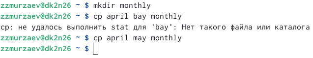{#fig:002 width=90%}
 
Копирование файлов в произвольном каталоге.(рис. @fig:003).
 
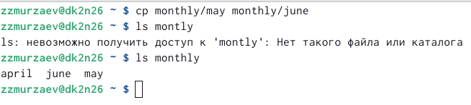{#fig:003 width=90%}

Копирование каталогов в текущем каталоге. Скопировать каталог monthly в каталог
monthly.00: (рис. @fig:004).

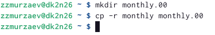{#fig:004 width=90%}

Копирование каталогов в произвольном каталоге (рис. @fig:005).

{#fig:005 width=90%}

Переименование файлов в текущем каталоге. (рис. @fig:006).

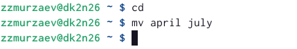{#fig:006 width=90%}

Перемещение файлов в другой каталог. (рис. @fig:007).

{#fig:007 width=90%}

Переименование каталогов в текущем каталоге.(рис. @fig:008).

{#fig:008 width=90%} 

Перемещение каталога в другой каталог. (рис. @fig:009).

{#fig:009 width=90%} 

Переименование каталога, не являющегося текущим. (рис. @fig:999).

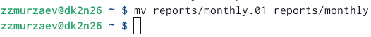{#fig:999 width=90%} 

Требуется создать файл ~/may с правом выполнения для владельца: (рис. @fig:010).

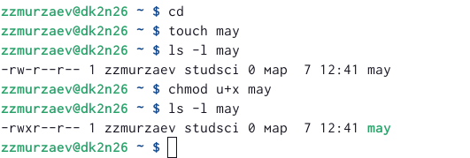{#fig:010 width=90%} 

Требуется лишить владельца файла ~/may права на выполнение: (рис. @fig:011).

{#fig:011 width=90%}

Требуется создать каталог monthly с запретом на чтение для членов группы и всех
остальных пользователей: (рис. @fig:012).

{#fig:012 width=90%}

Требуется создать файл ~/abc1 с правом записи для членов группы: (рис. @fig:013).

{#fig:013 width=90%}

2)Скопируйте файл /usr/include/sys/io.h в домашний каталог и назовите его
equipment. Если файла io.h нет, то используйте любой другой файл в каталоге
/usr/include/sys/ вместо него. (рис. @fig:014).

{#fig:014 width=90%}

В домашнем каталоге создайте директорию ~/ski.plases.(рис. @fig:015).

{#fig:015 width=90%}

Переместите файл equipment в каталог ~/ski.plases. (рис. @fig:016).

{#fig:016 width=90%}

Переименуйте файл ~/ski.plases/equipment в ~/ski.plases/equiplist. (рис. @fig:017).

{#fig:017 width=90%}

Создайте в домашнем каталоге файл abc1 и скопируйте его в каталог
~/ski.plases, назовите его equiplist2. (рис. @fig:018).

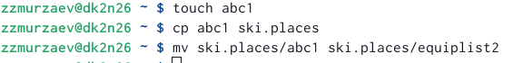{#fig:018 width=90%}

Создайте каталог с именем equipment в каталоге ~/ski.plases. (рис. @fig:019).

{#fig:019 width=90%}

Переместите файлы ~/ski.plases/equiplist и equiplist2 в каталог
~/ski.plases/equipment. (рис. @fig:020).

{#fig:020 width=90%}

Создайте и переместите каталог ~/newdir в каталог ~/ski.plases и назовите
его plans. (рис. @fig:021).

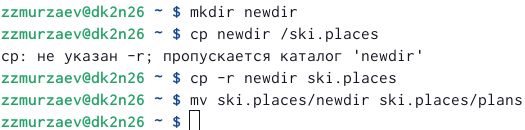{#fig:021 width=90%}

3)drwxr--r-- ... australia (рис. @fig:022).

{#fig:022 width=90%}

drwx--x--x ... play (рис. @fig:023).

{#fig:023 width=90%}

-r-xr--r-- ... my_os (рис. @fig:024).

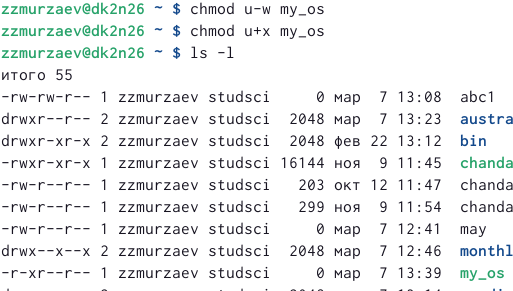{#fig:024 width=90%}

-rw-rw-r-- ... feathers (рис. @fig:025).

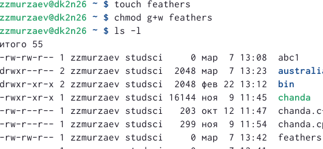{#fig:025 width=90%}

4)Просмотрите содержимое файла /etc/password. (рис. @fig:026).

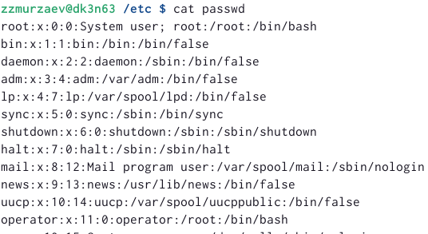{#fig:026 width=90%}

Скопируйте файл ~/feathers в файл ~/file.old. (рис. @fig:027).

{#fig:027 width=90%}

Переместите файл ~/file.old в каталог ~/play. (рис. @fig:028).

{#fig:028 width=90%}

Скопируйте каталог ~/play в каталог ~/fun. (рис. @fig:029).

{#fig:029 width=90%}

Переместите каталог ~/fun в каталог ~/play и назовите его games. (рис. @fig:030).

{#fig:030 width=90%}

Лишите владельца файла ~/feathers права на чтение (рис. @fig:031).

{#fig:031 width=90%}

Что произойдёт, если вы попытаетесь просмотреть файл ~/feathers командой
cat? (рис. @fig:032).

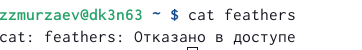{#fig:032 width=90%}

Дайте владельцу файла ~/feathers право на чтение. (рис. @fig:033).

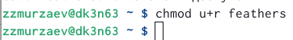{#fig:033 width=90%}

Лишите владельца каталога ~/play права на выполнение. (рис. @fig:034).

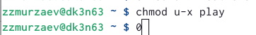{#fig:034 width=90%}

5)Прочитайте man по командам mount, fsck, mkfs, kill и кратко их охарактеризуйте,
приведя примеры (рис. @fig:035).

{#fig:035 width=90%}

# Ответы на вопросы

1. Характеристика файловой системы, которая использовалась в данной лабораторной работе: Файлы: abc1, april, may, june, july, isdv4.h, equipment, equiplist, equiplist2, my_os, feathers, file.old. Каталоги: monthly, monthly.00, tmp, monthly.01, reports, usr, ski.plases, equipment, newdir, plans, australia, play, etc, fun, games.

2. Пример общей структуры файловой системы: /home/pdarzhankina/monthly/april, где /home/pdarzhankina – домашний каталог, /monthly – каталог, находящийся в домашнем и содержащий файл, /аpril – файл, находящийся в каталоге.

3. Чтобы содержимое некоторой файловой системы было доступно операционной системе должно быть выполнено монтирование тома.

4. Основные причины нарушения целостности файловой системы:
• Один блок адресуется несколькими mode (принадлежит нескольким файлам).
• Блок помечен как свободный, но в то же время занят (на него ссылается onode).
• Блок помечен как занятый, но в то же время свободен (ни один inode на него не ссылается).
• Неправильное число ссылок в inode (недостаток или избыток ссылающихся записей в каталогах).
• Несовпадение между размером файла и суммарным размером адресуемых inode блоков.
• Недопустимые адресуемые блоки (например, расположенные за пределами файловой системы).
• “Потерянные” файлы (правильные inode, на которые не ссылаются записи каталогов).
• Недопустимые или неразмещенные номера inode в записях каталогов. Чтобы устранить повреждения файловой системы используется команда fsck.

5. Команда mkfs создаёт новую файловую систему.

6. Характеристика команд, которые позволяют просмотреть текстовые файлы:
• для просмотра небольших файлов удобно пользоваться командой cat.
• для просмотра больших файлов используйте команду less — она позволяет осуществлять постраничный просмотр файлов.
• для просмотра начала файла можно воспользоваться командой head, по умолчанию она выводит первые 10 строк файла.
• команда tail выводит несколько (по умолчанию 10) последних строк файла.

7. Основные возможности команды cp:
• копирование файла в текущем каталоге.
• копирование нескольких файлов в каталог.
• копирование файлов в произвольном каталоге. Опция i в команде cp выведет на экран запрос подтверждения о перезаписи файла, если на место целевого файла вы поставите имя уже существующего файла. Команда cp с опцией r (recursive) позволяет копировать каталоги вместе с входящими в них файлами и каталогами.

8. Характеристика команд перемещения и переименования файлов и каталогов:
• переименование файлов в текущем каталоге. mv
• перемещение файлов в другой каталог. mv Если необходим запрос подтверждения о перезаписи файла, то нужно использовать опцию i.
• переименование каталогов в текущем каталоге. mv
• перемещение каталога в другой каталог. mv
• переименование каталога, не являющегося текущим. mv < каталог/новое_название_каталога>

9. Каждый файл или каталог имеет права доступа: чтение (разрешены просмотр и копирование файла, разрешён просмотр списка входящих в каталог файлов), запись (разрешены изменение и переименование файла, разрешены создание и удаление файлов каталога), выполнение (разрешено выполнение файла, разрешён доступ в каталог и есть возможность сделать его текущим). Они могу быть изменены командой chmod.

# Выводы

Ознакомились с файловой системой Linux, её структурой, именами и содержанием каталогов.

# Список литературы{.unnumbered}

::: {#refs}
:::
