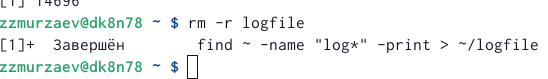
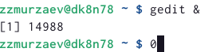

---
## Front matter
title: "Отчет по лабораторной работе"
subtitle: "Лабораторная работа 6"
author: "Мурзаев Замир Зейнадинович"

## Generic otions
lang: ru-RU
toc-title: "Содержание"

## Bibliography
bibliography: bib/cite.bib
csl: pandoc/csl/gost-r-7-0-5-2008-numeric.csl

## Pdf output format
toc: true # Table of contents
toc-depth: 2
lof: true # List of figures
lot: true # List of tables
fontsize: 12pt
linestretch: 1.5
papersize: a4
documentclass: scrreprt
## I18n polyglossia
polyglossia-lang:
  name: russian
  options:
	- spelling=modern
	- babelshorthands=true
polyglossia-otherlangs:
  name: english
## I18n babel
babel-lang: russian
babel-otherlangs: english
## Fonts
mainfont: PT Serif
romanfont: PT Serif
sansfont: PT Sans
monofont: PT Mono
mainfontoptions: Ligatures=TeX
romanfontoptions: Ligatures=TeX
sansfontoptions: Ligatures=TeX,Scale=MatchLowercase
monofontoptions: Scale=MatchLowercase,Scale=0.9
## Biblatex
biblatex: true
biblio-style: "gost-numeric"
biblatexoptions:
  - parentracker=true
  - backend=biber
  - hyperref=auto
  - language=auto
  - autolang=other*
  - citestyle=gost-numeric
## Pandoc-crossref LaTeX customization
figureTitle: "Рис."
tableTitle: "Таблица"
listingTitle: "Листинг"
lofTitle: "Список иллюстраций"
lotTitle: "Список таблиц"
lolTitle: "Листинги"
## Misc options
indent: true
header-includes:
  - \usepackage{indentfirst}
  - \usepackage{float} # keep figures where there are in the text
  - \floatplacement{figure}{H} # keep figures where there are in the text
---

# Цель работы

Ознакомление с инструментами поиска файлов и фильтрации текстовых данных. Приобретение практических навыков: по управлению процессами (и заданиями), по проверке использования диска и обслуживанию файловых систем.

# Задание

1. Осуществите вход в систему, используя соответствующее имя пользователя.

2. Запишите в файл file.txt названия файлов, содержащихся в каталоге /etc. Допишите в этот же файл названия файлов, содержащихся в вашем домашнем каталоге.

3. Выведите имена всех файлов из file.txt, имеющих расширение .conf, после чего запишите их в новый текстовой файл conf.txt.

4. Определите, какие файлы в вашем домашнем каталоге имеют имена, начинавшиеся с символа c? Предложите несколько вариантов, как это сделать.

5. Выведите на экран (по странично) имена файлов из каталога /etc, начинающиеся с символа h.

6. Запустите в фоновом режиме процесс, который будет записывать в файл ~/logfile файлы, имена которых начинаются с log.

7. Удалите файл ~/logfile.

8. Запустите из консоли в фоновом режиме редактор gedit.

9. Определите идентификатор процесса gedit, используя команду ps, конвейер и фильтр grep. Как ещё можно определить идентификатор процесса?

10. Прочтите справку (man) команды kill, после чего используйте её для завершения процесса gedit.

11. Выполните команды df и du, предварительно получив более подробную информацию об этих командах, с помощью команды man.

12. Воспользовавшись справкой команды find, выведите имена всех директорий, имеющихся в вашем домашнем каталоге.

# Теоретическое введение

Команда find используется для поиска и отображения на экран имён файлов, соответствующих заданной строке символов.

Найти в текстовом файле указанную строку символов позволяет команда grep.

Команда df показывает размер каждого смонтированного раздела диска.

Любую выполняющуюся в консоли команду или внешнюю программу можно запустить
в фоновом режиме. Для этого следует в конце имени команды указать знак амперсанда
&.

Любой команде, выполняемой в системе, присваивается идентификатор процесса
(process ID). Получить информацию о процессе и управлять им, пользуясь идентифи-
катором процесса, можно из любого окна командного интерпретатора.

# Выполнение лабораторной работы

1)Осуществляем вход в систему, используя соответствующее имя пользователя (просто заходим в терминал). 

2)Записываем в файл file.txt названия файлов, содержащихся в каталоге /etc. Дописываем в этот же файл названия файлов, содержащихся в вашем домашнем каталоге. (рис. @fig:001).

{#fig:001 width=90%}

3)Выводим имена всех файлов из file.txt, имеющих расширение .conf, после чего записываем их в новый текстовый файл conf.txt. (рис. @fig:002).

{#fig:002 width=90%}

4)Определяем какие файлы в нашем каталоге имеют имена, начинающиеся с символа c. Показываем несколько вариантов. (рис. @fig:003). (рис. @fig:004).

{#fig:003 width=90%}

{#fig:004 width=90%}

5)Выводим на экран имена файлов из каталога /etc, начинающиеся с символа h. (рис. @fig:005).

{#fig:005 width=90%}

6)Запускаем в фоновом режиме процесс, который будет записывать в файл logfile файлы, имена которых начинаются с log. (рис. @fig:006).

{#fig:006 width=90%}

7)Удаляем файл. (рис. @fig:007).

{#fig:007 width=90%}

8)Запускаем из консоли в фоновом режиме редактор gedit. (рис. @fig:008).

{#fig:008 width=90%}

9)Определяем идентификатор процесса gedit, используя команду ps, конвейер и фильтр grep. (рис. @fig:009). Можно помимо этого использовать pgrep для того, чтобы узнать идентификатор.

{#fig:009 width=90%}

10)Прочитываем справку команды kill, после чего используем её для завершения процесса gedit. (рис. @fig:010).

{#fig:010 width=90%}

11)Выполняем команды df и du. До этого используем команду man. (рис. @fig:011).

{#fig:011 width=90%}

12)С помощью команды find, выводим имена всех директорий, имеющихся в нашем домашнем каталоге. (рис. @fig:012).

{#fig:012 width=90%}

# Ответы на контрольные вопросы

1)stdin, stdout, stderr.

2)> перенаправляет вывод в новый файл, >> перенаправляет вывод в файл, добавляя содержимое в конце.

3) Конвейер (от англ. convey «передавать») — машина непрерывного транспорта, предназначенная для перемещения сыпучих, кусковых или штучных грузов. Часто также называется транспортёром.

4)процесс — задача, выполняемая процессором; программа — команда для процессора.

5)PID (process Id) — идентификатор процесса; GID — идентификатор группы.

6)задача — запущенная на фоне программа. Команда jobs позволяет вывести информацию о текущих задачах. Мт информацию о найденных по заданному шаблону файлах.

7)top показывает объем занятой памяти вместе с кэш. htop выдает объём реально занятой памяти без кэша.

8)Команда find используется для поиска и отображения на экран имён файлов, соответствующих заданной строке символов.

9)можно использовать команду grep "текст" каталог.

10)команда df показывает искомое.

11)df ~

12)пусть зачто — название зависшего процесса. Тогда выполнить задачу можно при помощи команды kill -15 "$(pidof зачто)".

# Выводы

Ознакомились с инструментами поиска файлов и фильтрации текстовых данных. Приобретение практических навыков: по управлению процессами (и заданиями), по проверке использования диска и обслуживанию файловых систем. 

# Список литературы{.unnumbered}

::: {#refs}
:::
