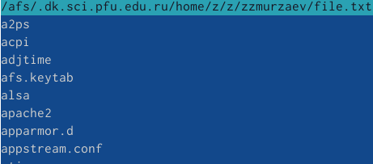
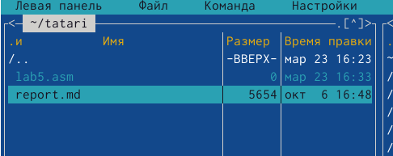
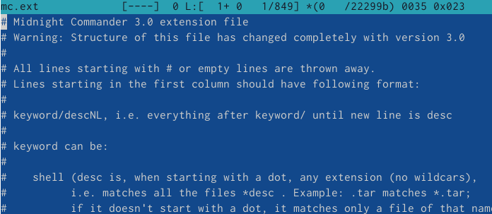
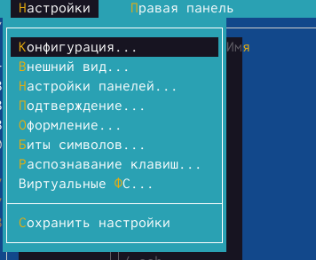
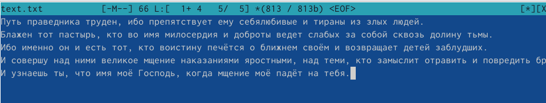
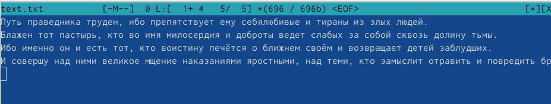
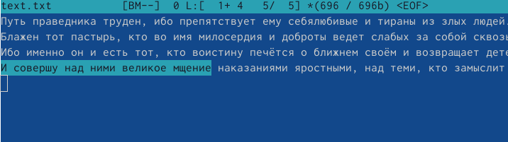
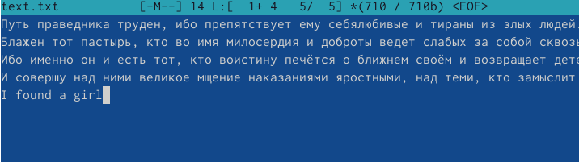
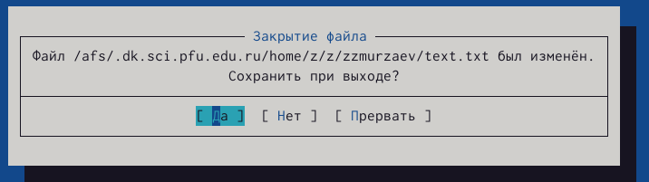

---
## Front matter
lang: ru-RU
title: Презентация по лабораторной работе
subtitle: Лабораторная работа 7
author:
  - Кулябов Д. С.
institute:
  - Российский университет дружбы народов, Москва, Россия
  - Объединённый институт ядерных исследований, Дубна, Россия
date: 01 января 1970

## i18n babel
babel-lang: russian
babel-otherlangs: english

## Formatting pdf
toc: false
toc-title: Содержание
slide_level: 2
aspectratio: 169
section-titles: true
theme: metropolis
header-includes:
 - \metroset{progressbar=frametitle,sectionpage=progressbar,numbering=fraction}
 - '\makeatletter'
 - '\beamer@ignorenonframefalse'
 - '\makeatother'
---

# Информация

## Докладчик

:::::::::::::: {.columns align=center}
::: {.column width="70%"}

  * Мурзаев Замир Зейнадинович
  * д.ф.-м.н., профессор
  * профессор кафедры прикладной информатики и теории вероятностей
  * Российский университет дружбы народов
  * [kulyabov-ds@rudn.ru](mailto:kulyabov-ds@rudn.ru)
  * <https://yamadharma.github.io/ru/>

:::
::: {.column width="30%"}

:::
::::::::::::::

# Вводная часть

## Актуальность

Нужно для того, чтобы уметь пользоваться mc

## Объект и предмет исследования

Midnight commander

## Цели и задачи

Освоение основных возможностей командной оболочки Midnight Commander. Приоб-
ретение навыков практической работы по просмотру каталогов и файлов; манипуляций
с ними.

# Выполнение заданий по mc

## 1)Изучаем информацию о mc, вызвав в командной строке man mc 

{#fig:001 width=90%}

## 2)Вызываем mc, изучаем его структуру и меню 

{#fig:002 width=90%}

## 5)Просматриваем содержимое текстового файла 

{#fig:003 width=90%}

## Редактируем текст и не сохраняем изменения 

{#fig:004 width=90%}

## Создаем новый каталог 

{#fig:005 width=90%}

## Копируем файлы в создынный каталог 

{#fig:006 width=90%}

## 6)Повторяем одну из предыдущих команд 

{#fig:007 width=90%}

## Переходим в домашний каталог 

{#fig:008 width=90%}

## Анализ файла меню 

{#fig:009 width=90%}

## Анализ файла расширений 

{#fig:010 width=90%}

## Осваиваем операции, определяющие структуру экрана mc. 

{#fig:011 width=90%}

# Задание по встроенному редактору mc

## 1)Создаем файловый текст 

{#fig:012 width=90%}

## 2)Открываем файл в редакторе 

{#fig:013 width=90%}

## 3)Вставляем текст в файл 

{#fig:014 width=90%}

## 4)Удаляем строку текста 

{#fig:015 width=90%}

## Выделяем фрагмент и копируем на новую строку 

{#fig:016 width=90%}

## Сохраняем файл 

{#fig:017 width=90%}

## Отменяем послденее действие 

{#fig:018 width=90%}

## Переходим в конец файла 

{#fig:019 width=90%}

## Переходим в начало файла 

{#fig:020 width=90%}

## Сохраняем и закрываем файл 

{#fig:021 width=90%}

## 5)Открываем файл с исходным текстом на некотором языке программирования 

{#fig:022 width=90%}

## 6)Выключаем подсветку 

{#fig:023 width=90%}

## Выводы

Освоены основные возможности командной оболочки Midnight Commander. Приобретены навыки практической работы по просмотру каталогов и файлов; манипулияций с ними.

