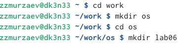
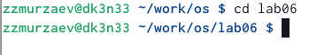
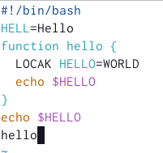
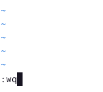
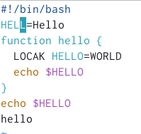
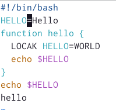
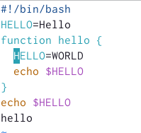
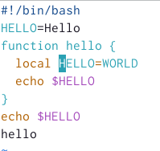
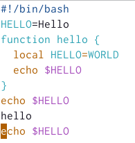

---
## Front matter
lang: ru-RU
title: Структура научной презентации
subtitle: Простейший шаблон
author:
  - Кулябов Д. С.
institute:
  - Российский университет дружбы народов, Москва, Россия
  - Объединённый институт ядерных исследований, Дубна, Россия
date: 01 января 1970

## i18n babel
babel-lang: russian
babel-otherlangs: english

## Formatting pdf
toc: false
toc-title: Содержание
slide_level: 2
aspectratio: 169
section-titles: true
theme: metropolis
header-includes:
 - \metroset{progressbar=frametitle,sectionpage=progressbar,numbering=fraction}
 - '\makeatletter'
 - '\beamer@ignorenonframefalse'
 - '\makeatother'
---

# Информация

## Докладчик

:::::::::::::: {.columns align=center}
::: {.column width="70%"}

  * Мурзаев Замир Зейнадинович
  * студент
  * Российский университет дружбы народов

:::
::: {.column width="30%"}

:::
::::::::::::::

# Вводная часть

## Объект и предмет исследования

- Встроенный редактор vi

## Цели и задачи

- Познакомиться с операционной системой Linux. 
- Получить практические навыки работы с редактором vi, установленным по умолчанию практически во всех дистрибутивах.

## Материалы и методы

- https://esystem.rudn.ru/

# Выполнение лабораторной работы

## 1)Создаем каталог с именем ~/work/os/lab06. 

{#fig:001 width=90%}

## 2)Переходим во вновь созданный каталог 

{#fig:002 width=90%}

## 3)Вызываем vi и создаем файл hello.sh 

{#fig:003 width=90%}

## 4)Вводим следующий текст 

{#fig:004 width=90%}

## 6)Переходим в режим последней строки 

{#fig:005 width=90%}

## 7)Сохраняем текст и завершаем работу 

{#fig:006 width=90%}

## 8)Делаем файл исполняемым 

{#fig:007 width=90%}

## 1)Вызываем vi на редактирование файла 

{#fig:008 width=90%}

## 2)Устанавливаем курсор в конец слова HELL 

{#fig:009 width=90%}

## 3)Переходим в режим вставки и изменяем слово. Затем возвращаемся в командный режим 

{#fig:010 width=90%}

## 4)Стираем слово LOCAL

{#fig:011 width=90%}

## 5)Переходим в режим вставки, пишем local и возвращаемся в командный режим.
{#fig:012 width=90%}

## 6)Устанавливаем курсор на последней строке файла. И ставим после этого строку. 

{#fig:013 width=90%}

## 8)Удаляем последнюю строку 

{#fig:014 width=90%}

## 9)Отменяем последнюю команду 

{#fig:015 width=90%}

## 10)Записываем произведенные изменения и выходим из vi. 

{#fig:016 width=90%}

# Результаты

## Выводы

- Мы познакомились с операционной системой линукс.
- Получили практические навыки работы с редактором vi, установленным по умолчанию во всех дистрибутивах.

:::

