---
## Front matter
title: "Отчет по лабораторной работе"
subtitle: "Лабораторная работа № 9"
author: "Мурзаев Замир Зейнадинович"

## Generic otions
lang: ru-RU
toc-title: "Содержание"

## Bibliography
bibliography: bib/cite.bib
csl: pandoc/csl/gost-r-7-0-5-2008-numeric.csl

## Pdf output format
toc: true # Table of contents
toc-depth: 2
lof: true # List of figures
lot: true # List of tables
fontsize: 12pt
linestretch: 1.5
papersize: a4
documentclass: scrreprt
## I18n polyglossia
polyglossia-lang:
  name: russian
  options:
	- spelling=modern
	- babelshorthands=true
polyglossia-otherlangs:
  name: english
## I18n babel
babel-lang: russian
babel-otherlangs: english
## Fonts
mainfont: PT Serif
romanfont: PT Serif
sansfont: PT Sans
monofont: PT Mono
mainfontoptions: Ligatures=TeX
romanfontoptions: Ligatures=TeX
sansfontoptions: Ligatures=TeX,Scale=MatchLowercase
monofontoptions: Scale=MatchLowercase,Scale=0.9
## Biblatex
biblatex: true
biblio-style: "gost-numeric"
biblatexoptions:
  - parentracker=true
  - backend=biber
  - hyperref=auto
  - language=auto
  - autolang=other*
  - citestyle=gost-numeric
## Pandoc-crossref LaTeX customization
figureTitle: "Рис."
tableTitle: "Таблица"
listingTitle: "Листинг"
lofTitle: "Список иллюстраций"
lotTitle: "Список таблиц"
lolTitle: "Листинги"
## Misc options
indent: true
header-includes:
  - \usepackage{indentfirst}
  - \usepackage{float} # keep figures where there are in the text
  - \floatplacement{figure}{H} # keep figures where there are in the text
---

# Цель работы

Цель познакомиться с операционной системой Linux и получить практические навыки работы с редактором Emacs.

# Задание

1. Открыть emacs.
2. Создать файл lab07.sh с помощью комбинации Ctrl-x Ctrl-f (C-x C-f).
3. Наберите текст
4. Сохранить файл с помощью комбинации Ctrl-x Ctrl-s (C-x C-s).
5. Проделать с текстом стандартные процедуры редактирования, каждое действие долж-
но осуществляться комбинацией клавиш.
5.1. Вырезать одной командой целую строку (С-k).
5.2. Вставить эту строку в конец файла (C-y).
5.3. Выделить область текста (C-space).
5.4. Скопировать область в буфер обмена (M-w).
5.5. Вставить область в конец файла.
5.6. Вновь выделить эту область и на этот раз вырезать её (C-w).
5.7. Отмените последнее действие (C-/).
6. Научитесь использовать команды по перемещению курсора.
6.1. Переместите курсор в начало строки (C-a).
6.2. Переместите курсор в конец строки (C-e).
6.3. Переместите курсор в начало буфера (M-<).
6.4. Переместите курсор в конец буфера (M->).
7. Управление буферами.
7.1. Вывести список активных буферов на экран (C-x C-b).
7.2. Переместитесь во вновь открытое окно (C-x) o со списком открытых буферов
и переключитесь на другой буфер.
7.3. Закройте это окно (C-x 0).
7.4. Теперь вновь переключайтесь между буферами, но уже без вывода их списка на
экран (C-x b).
8. Управление окнами.
8.1. Поделите фрейм на 4 части: разделите фрейм на два окна по вертикали (C-x 3),
а затем каждое из этих окон на две части по горизонтали (C-x 2) 
8.2. В каждом из четырёх созданных окон откройте новый буфер (файл) и введите
несколько строк текста.
9. Режим поиска
9.1. Переключитесь в режим поиска (C-s) и найдите несколько слов, присутствующих
в тексте.
9.2. Переключайтесь между результатами поиска, нажимая C-s.
9.3. Выйдите из режима поиска, нажав C-g.
9.4. Перейдите в режим поиска и замены (M-%), введите текст, который следует найти
и заменить, нажмите Enter , затем введите текст для замены. После того как будут
подсвечены результаты поиска, нажмите ! для подтверждения замены.
9.5. Испробуйте другой режим поиска, нажав M-s o. Объясните, чем он отличается от
обычного режима?

# Выполнение лабораторной работы

1)Открываем emacs (рис. @fig:001).

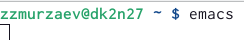{#fig:001 width=90%}

2)Создаем файл lab09.sh (рис. @fig:002).

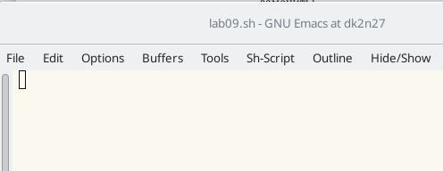{#fig:002 width=90%}

3)Набираем текст (рис. @fig:003).

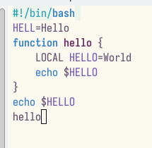{#fig:003 width=90%}

5.1)Вырезаем одной командой целую строку (рис. @fig:004).

{#fig:004 width=90%}

5.2)Вставляем эту строку в конец файла (рис. @fig:005).

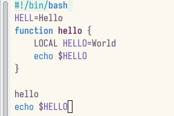{#fig:005 width=90%}

5.3)Выделяем область текста (рис. @fig:006).

{#fig:006 width=90%}

5.5)Скопируем область и вставим в конец файла (рис. @fig:007).

{#fig:007 width=90%}

5.6)Вновь выделяем эту область и вырезаем её (рис. @fig:008).

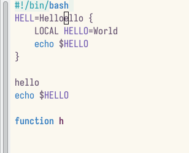{#fig:008 width=90%} 

5.7)Отменяем последнее действие (рис. @fig:009).

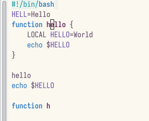{#fig:009 width=90%} 

6.1)Перемещаем курсор в начало строки (рис. @fig:010).

{#fig:010 width=90%} 

6.2)Перемещаем курсор в конец строки (рис. @fig:011).

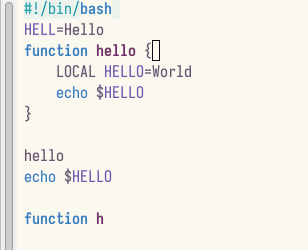{#fig:011 width=90%} 

6.3)Перемещаем курсор в начало буфера (рис. @fig:012).

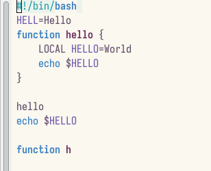{#fig:012 width=90%} 

6.4)Перемещаем курсор в конец буфера (рис. @fig:013).

{#fig:013 width=90%} 

7.1)Выводим список активных буферов на экран (рис. @fig:014).

{#fig:014 width=90%}

7.2)Перемещаемся во вновь открытое окно со списком открытых буферов и переключаемся на другой буфер (рис. @fig:015).

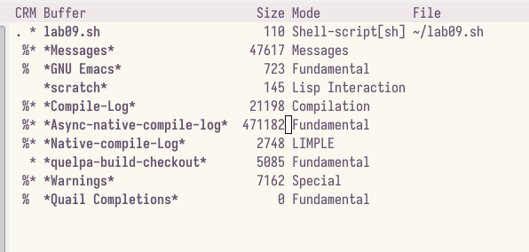{#fig:015 width=90%}

7.4)Переключаемся между буферами, но уже без выхода их списка на экран (рис. @fig:016).

{#fig:016 width=90%}

8.1)Делим фрейм на 4 части (рис. @fig:017).

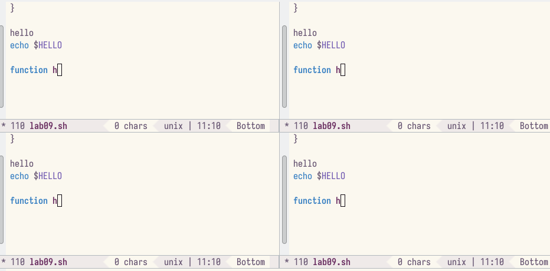{#fig:017 width=90%}

8.2)Вводим несколько строк текста (рис. @fig:018).

{#fig:018 width=90%}

9.1)Переключаемся в режим поиска и находим несколько слов, присутствующих в тексте (рис. @fig:019).

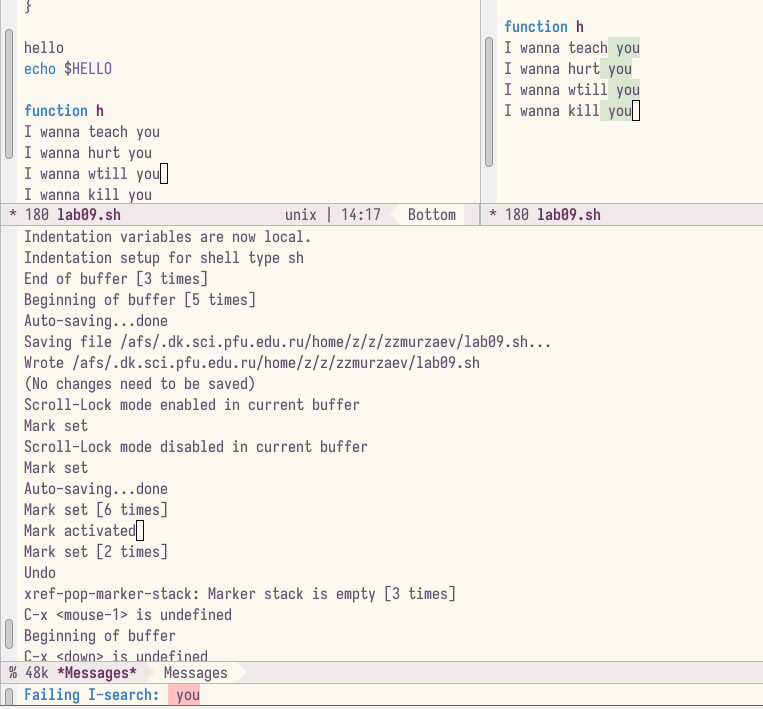{#fig:019 width=90%}

9.2)Переключаемся между результатами поиска (рис. @fig:020).

{#fig:020 width=90%} 

9.3)Выходим из режима поиска (рис. @fig:021).

{#fig:021 width=90%} 

#Контрольные вопросы 

1. Кратко охарактеризуйте редактор emacs.
2. Какие особенности данного редактора могут сделать его сложным для освоения но-
вичком?
3. Своими словами опишите, что такое буфер и окно в терминологии emacs’а.
4. Можно ли открыть больше 10 буферов в одном окне?
5. Какие буферы создаются по умолчанию при запуске emacs?
6. Какие клавиши вы нажмёте, чтобы ввести следующую комбинацию C-c | и C-c C-|?
7. Как поделить текущее окно на две части?
8. В каком файле хранятся настройки редактора emacs?
9. Какую функцию выполняет клавиша назад и можно ли её переназначить?
10. Какой редактор вам показался удобнее в работе vi или emacs? Поясните почему.

# Ответы на вопросы 

    1)Emacs представляет собой мощный экранный редактор текста, написанный на языке высокого уровня Elisp.

    2)Развитие Emacs в сторону его многогранности послужило причиной того, что и без того интуитивно непонятная программа стала чрезвычайно сложной в применении. В частности, управление осуществляется при помощи различных клавиатурных комбинаций, запомнить которые будет непросто.

    3)Буфер – что-то, состоящее из текста. Окно – область с одним из буферов.

    4)В одном окне можно открыть больше 10 буферов.

    5)После запуска emacs без каких-либо параметров в основном окне отображается буфер scratch, который используется для оценки выражений Emacs Lisp, а также для заметок, которые вы не хотите сохранять. Этот буфер не сохраняется автоматически.

    6)Чтобы ввести следующую комбинацию C-c | я нажму клавиши: Control+c и Shift+, и для C-c C-|: Control+c и Control+Shift+.

    7)Поделить текущее окно на две части можно двумя комбинациями клавиш: C-x 3 или C-x 2.

    8)Настроить или расширить Emacs можно написав или изменив файл ~/.emacs.

    9)Клавиша  выполняет функцию перемещения курсора в открытом окне также, как и многие другие клавиши её можно переназначить.

    10)Редактор emacs показался мне удобнее из-за возможности открытия нескольких окон с буферами и работать комбинациями клавиш в этот редакторе мне было проще.

# Выводы

Познакомились с операционной системой Linux и получили практические навыки работы с редактором Emacs.

# Список литературы{.unnumbered}

::: {#refs}
:::
