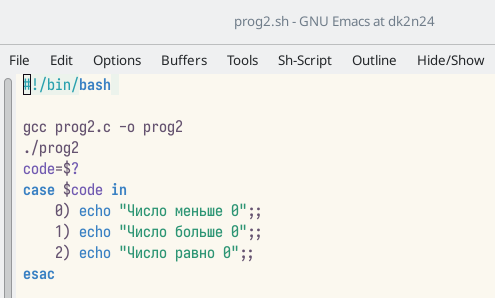
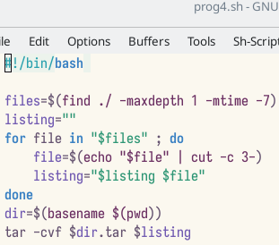

---
## Front matter
lang: ru-RU
title: Структура научной презентации
subtitle: Простейший шаблон
author:
  - Кулябов Д. С.
institute:
  - Российский университет дружбы народов, Москва, Россия
  - Объединённый институт ядерных исследований, Дубна, Россия
date: 01 января 1970

## i18n babel
babel-lang: russian
babel-otherlangs: english

## Formatting pdf
toc: false
toc-title: Содержание
slide_level: 2
aspectratio: 169
section-titles: true
theme: metropolis
header-includes:
 - \metroset{progressbar=frametitle,sectionpage=progressbar,numbering=fraction}
 - '\makeatletter'
 - '\beamer@ignorenonframefalse'
 - '\makeatother'
---

# Информация

## Докладчик

:::::::::::::: {.columns align=center}
::: {.column width="70%"}

  * Мурзаев Замир Зейнадинович
  * д.ф.-м.н., профессор
  * профессор кафедры прикладной информатики и теории вероятностей
  * Российский университет дружбы народов
  * [kulyabov-ds@rudn.ru](mailto:kulyabov-ds@rudn.ru)
  * <https://yamadharma.github.io/ru/>

:::
::: {.column width="30%"}

:::
::::::::::::::

# Цель работы

Цель - изучить основы программирования в оболочке ОС UNIX, научиться писать более сложные командные файлы с использованием логических управляющих конструкций и циклов.

# Выполнение лабораторной работы

## 1)Пишем программу, которая анализирует командную строку, а затем ищет нужные строки 

{#fig:001 width=90%}

## 2)Пишем код на языке C и командный файл, который взаимодействует с ним 

{#fig:002 width=90%}

##
{#fig:003 width=90%}

## 3)Пишем файл, который генерирует определенное количество файлов 

{#fig:004 width=90%}

## 4)Пишем файл, который запаковывает в архив все файлы в директории 

{#fig:005 width=90%}

# Выводы

Изучены основы программирования в оболочке ОС UNIX и приобретены навыки по написанию более сложных командных файлов с использованием логических управляющих конструкций и циклов.

:::

