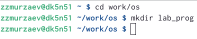
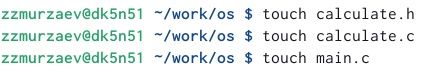
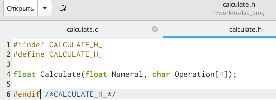

---
## Front matter
lang: ru-RU
title: Структура научной презентации
subtitle: Простейший шаблон
author:
  - Кулябов Д. С.
institute:
  - Российский университет дружбы народов, Москва, Россия
  - Объединённый институт ядерных исследований, Дубна, Россия
date: 01 января 1970

## i18n babel
babel-lang: russian
babel-otherlangs: english

## Formatting pdf
toc: false
toc-title: Содержание
slide_level: 2
aspectratio: 169
section-titles: true
theme: metropolis
header-includes:
 - \metroset{progressbar=frametitle,sectionpage=progressbar,numbering=fraction}
 - '\makeatletter'
 - '\beamer@ignorenonframefalse'
 - '\makeatother'
---

# Информация

## Докладчик

:::::::::::::: {.columns align=center}
::: {.column width="70%"}

  * Мурзаев Замир Зейнадинович
  * д.ф.-м.н., профессор
  * профессор кафедры прикладной информатики и теории вероятностей
  * Российский университет дружбы народов
  * [kulyabov-ds@rudn.ru](mailto:kulyabov-ds@rudn.ru)
  * <https://yamadharma.github.io/ru/>

:::
::: {.column width="30%"}

:::
::::::::::::::

## Цель работы

Приобрести простейшие навыки разработки, анализа, тестирования и отладки при-
ложений в ОС типа UNIX/Linux на примере создания на языке программирования
С калькулятора с простейшими функциями.

## Задание

1. В домашнем каталоге создайте подкаталог ~/work/os/lab_prog.
2. Создайте в нём файлы: calculate.h, calculate.c, main.c.
3. Выполните компиляцию программы посредством gcc:
4. При необходимости исправьте синтаксические ошибки.
5. Создайте Makefile со следующим содержанием:
6. С помощью gdb выполните отладку программы calcul (перед использованием gdb
исправьте Makefile):

# Выполнение лабораторной работы

## В домашнем каталоге создаем подкаталог 

{#fig:001 width=70%}

## Создаем в нем файлы 

{#fig:002 width=70%}

## Заполняем calculate.c 

{#fig:003 width=70%}

## Заполняем calculate.h 

{#fig:004 width=70%}

## Заполняем main.c 

{#fig:005 width=70%}

## Компилируем файлы 

{#fig:006 width=70%}

## Создаем Makefile 

В содержании файла указаны флаги компиляции, тип компилятора и файлы, которые должен собрать сборщик.

{#fig:007 width=70%}

## Проверяем работу калькулятора 

{#fig:008 width=70%}

## Выводы

Приобретены простейшие навыки разработки, анализа, тестирования и отладки при-
ложений в ОС типа UNIX/Linux на примере создания на языке программирования
С калькулятора с простейшими функциями.

:::

