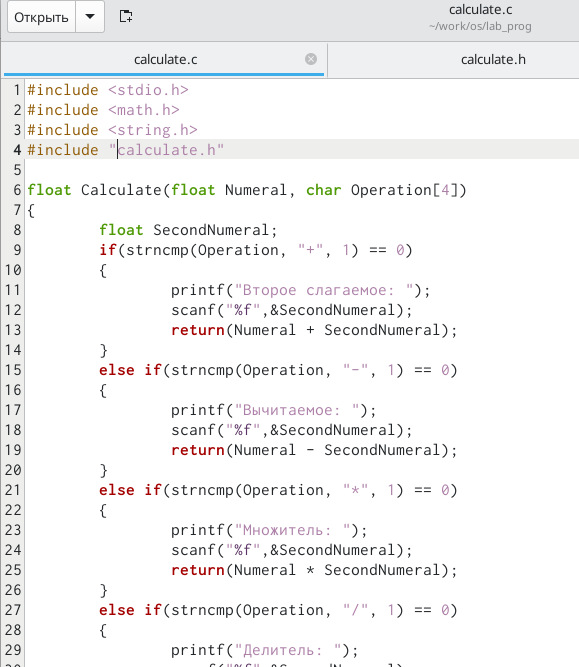
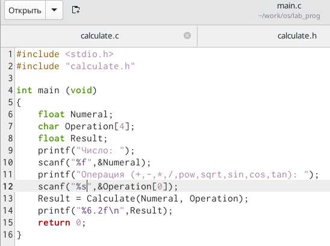
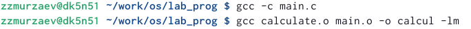
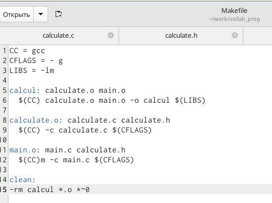
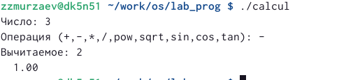

---
## Front matter
title: "Отчёт по лабораторной работе"
subtitle: "Лабораторная работа № 13"
author: "Мурзаев Замир Зейнадинович"

## Generic otions
lang: ru-RU
toc-title: "Содержание"

## Bibliography
bibliography: bib/cite.bib
csl: pandoc/csl/gost-r-7-0-5-2008-numeric.csl

## Pdf output format
toc: true # Table of contents
toc-depth: 2
lof: true # List of figures
lot: true # List of tables
fontsize: 12pt
linestretch: 1.5
papersize: a4
documentclass: scrreprt
## I18n polyglossia
polyglossia-lang:
  name: russian
  options:
	- spelling=modern
	- babelshorthands=true
polyglossia-otherlangs:
  name: english
## I18n babel
babel-lang: russian
babel-otherlangs: english
## Fonts
mainfont: PT Serif
romanfont: PT Serif
sansfont: PT Sans
monofont: PT Mono
mainfontoptions: Ligatures=TeX
romanfontoptions: Ligatures=TeX
sansfontoptions: Ligatures=TeX,Scale=MatchLowercase
monofontoptions: Scale=MatchLowercase,Scale=0.9
## Biblatex
biblatex: true
biblio-style: "gost-numeric"
biblatexoptions:
  - parentracker=true
  - backend=biber
  - hyperref=auto
  - language=auto
  - autolang=other*
  - citestyle=gost-numeric
## Pandoc-crossref LaTeX customization
figureTitle: "Рис."
tableTitle: "Таблица"
listingTitle: "Листинг"
lofTitle: "Список иллюстраций"
lotTitle: "Список таблиц"
lolTitle: "Листинги"
## Misc options
indent: true
header-includes:
  - \usepackage{indentfirst}
  - \usepackage{float} # keep figures where there are in the text
  - \floatplacement{figure}{H} # keep figures where there are in the text
---

# Цель работы

Приобрести простейшие навыки разработки, анализа, тестирования и отладки при-
ложений в ОС типа UNIX/Linux на примере создания на языке программирования
С калькулятора с простейшими функциями.

# Задание

1. В домашнем каталоге создайте подкаталог ~/work/os/lab_prog.
2. Создайте в нём файлы: calculate.h, calculate.c, main.c.
3. Выполните компиляцию программы посредством gcc:
4. При необходимости исправьте синтаксические ошибки.
5. Создайте Makefile со следующим содержанием:
6. С помощью gdb выполните отладку программы calcul (перед использованием gdb
исправьте Makefile):

# Выполнение лабораторной работы

В домашнем каталоге создаем подкаталог (рис. @fig:001).

{#fig:001 width=70%}

Создаем в нем файлы (рис. @fig:002).

{#fig:002 width=70%}

Заполняем calculate.c (рис. @fig:003).

{#fig:003 width=70%}

Заполняем calculate.h (рис. @fig:004).

{#fig:004 width=70%}

Заполняем main.c (рис. @fig:005).

{#fig:005 width=70%}

Компилируем файлы (рис. @fig:006).

{#fig:006 width=70%}

Создаем Makefile (рис. @fig:007).

В содержании файла указаны флаги компиляции, тип компилятора и файлы, которые должен собрать сборщик.

{#fig:007 width=70%}

Проверяем работу калькулятора (рис. @fig:008).

{#fig:008 width=70%}
# Выводы

Приобретены простейшие навыки разработки, анализа, тестирования и отладки при-
ложений в ОС типа UNIX/Linux на примере создания на языке программирования
С калькулятора с простейшими функциями.

# Ответы на вопросы

    Как получить информацию о возможностях программ gcc, make, gdb и др.?

Ответ: при помощи программы man.

    Назовите и дайте краткую характеристику основным этапам разработки приложений в UNIX.

Ответ: 1. Выбор названия 2. Выбор языка программирования 3. Попытка выполнить работу всю зараз 4. Отрицание 5. Гнев 6. Торг 7. Депрессия 8. Принятие

    Что такое суффикс в контексте языка программирования? Приведите примеры использования.

Ответ: финальная часть названия программы, обычно отделяемая точкой.

    Каково основное назначение компилятора языка С в UNIX?

Ответ: компилятор языка C в UNIX в основном компилирует программы языка C в UNIX, написанные на языке C в UNIX.

    Для чего предназначена утилита make?

Ответ: При разработке большой программы, состоящей из нескольких исходных файлов заголовков, приходится постоянно следить за файлами, которые требуют перекомпиляции после внесения изменений. Программа make освобождает пользователя от такой рутинной работы и служит для документирования взаимосвязей между файлами. Описание взаимосвязей и соответствующих действий хранится в так называемом make-файле, который по умолчанию имеет имя makefile или Makefile.

    Приведите пример структуры Makefile. Дайте характеристику основным элементам этого файла.

Ответ: В общем случае make-файл содержит последовательность записей (строк), определяющих зависимости между файлами. Первая строка записи представляет собой список целевых (зависимых) файлов, разделенных пробелами, за которыми следует двоеточие и список файлов, от которых зависят целевые. Текст, следующий за точкой с запятой, и все последующие строки, начинающиеся с литеры табуляции, являются командами OC UNIX, которые необходимо выполнить для обновления целевого файла. Таким образом, спецификация взаимосвязей имеет формат: target1 [ target2...]: [:] [dependment1...] [(tab)commands] [#commentary] [(tab)commands] [#commentary], где # — специфицирует начало комментария, так как содержимое строки, начиная с # и до конца строки, не будет обрабатываться командой make; : — последовательность команд ОС UNIX должна содержаться в одной строке make-файла (файла описаний), есть возможность переноса команд (), но она считается как одна строка; :: — последовательность команд ОС UNIX может содержаться в нескольких последовательных строках файла описаний. Приведённый выше make-файл для программы abcd.c включает два способа компиляции и построения исполняемого модуля. Первый способ предусматривает обычную компиляцию с построением исполняемого модуля с именем abcd. Второй способ позволяет включать в исполняемый модуль testabcd возможность выполнить процесс отладки на уровне исходного текста. Пример можно найти в задании 5.

    Назовите основное свойство, присущее всем программам отладки. Что необходимо сделать, чтобы его можно было использовать?

Ответ: свойство - анализ кода; для анализа необходимо скомпилировать программу.

    Назовите и дайте основную характеристику основным командам отладчика gdb.

Ответ: см. ответ к вопросу 6.

    Опишите по шагам схему отладки программы, которую вы использовали при выполнении лабораторной работы.

Ответ: 1. Вначале я запустил gdb 2. Затем я его закрыл

    Прокомментируйте реакцию компилятора на синтаксические ошибки в программе при его первом запуске.

Ответ: когда я увидел реакцию компилятора на синтаксические ошибки в программе при его первом запуске,я был возмущён, поражён, обескуражен, ошеломлён, фрустрирован и изумлён. Но использовал совершенно другие выражения.

    Назовите основные средства, повышающие понимание исходного кода программы.

Ответ: Если вы работаете с исходным кодом, который не вами разрабатывался, то назначение различных конструкций может быть не совсем понятным. Система разработки приложений UNIX предоставляет различные средства, повышающие понимание исходного кода. К ним относятся: – cscope - исследование функций, содержащихся в программе; – splint — критическая проверка программ, написанных на языке Си.

    Каковы основные задачи, решаемые программой splint?

Ответ: анализ кода.
# Список литературы{.unnumbered}

::: {#refs}
:::
