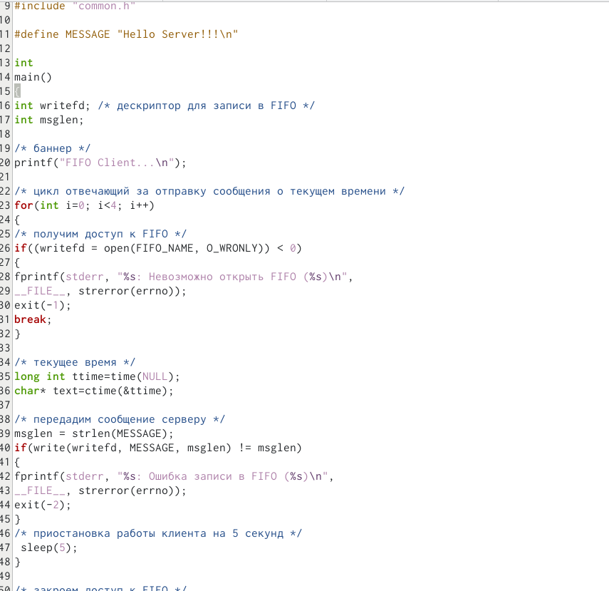
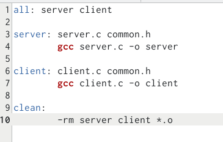
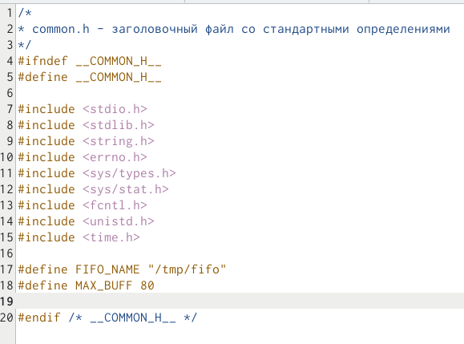

---
## Front matter
title: "Отчёт по лабораторной работе"
subtitle: "Лабораторная работа № 14"
author: "Мурзаев Замир Зейнадинович"

## Generic otions
lang: ru-RU
toc-title: "Содержание"

## Bibliography
bibliography: bib/cite.bib
csl: pandoc/csl/gost-r-7-0-5-2008-numeric.csl

## Pdf output format
toc: true # Table of contents
toc-depth: 2
lof: true # List of figures
lot: true # List of tables
fontsize: 12pt
linestretch: 1.5
papersize: a4
documentclass: scrreprt
## I18n polyglossia
polyglossia-lang:
  name: russian
  options:
	- spelling=modern
	- babelshorthands=true
polyglossia-otherlangs:
  name: english
## I18n babel
babel-lang: russian
babel-otherlangs: english
## Fonts
mainfont: PT Serif
romanfont: PT Serif
sansfont: PT Sans
monofont: PT Mono
mainfontoptions: Ligatures=TeX
romanfontoptions: Ligatures=TeX
sansfontoptions: Ligatures=TeX,Scale=MatchLowercase
monofontoptions: Scale=MatchLowercase,Scale=0.9
## Biblatex
biblatex: true
biblio-style: "gost-numeric"
biblatexoptions:
  - parentracker=true
  - backend=biber
  - hyperref=auto
  - language=auto
  - autolang=other*
  - citestyle=gost-numeric
## Pandoc-crossref LaTeX customization
figureTitle: "Рис."
tableTitle: "Таблица"
listingTitle: "Листинг"
lofTitle: "Список иллюстраций"
lotTitle: "Список таблиц"
lolTitle: "Листинги"
## Misc options
indent: true
header-includes:
  - \usepackage{indentfirst}
  - \usepackage{float} # keep figures where there are in the text
  - \floatplacement{figure}{H} # keep figures where there are in the text
---

# Цель работы

Приобретение практических навыков работы с именованными каналами.

# Задание

Изучите приведённые в тексте программы server.c и client.c. Взяв данные примеры
за образец, напишите аналогичные программы, внеся следующие изменения:
1. Работает не 1 клиент, а несколько (например, два).
2. Клиенты передают текущее время с некоторой периодичностью (например, раз в пять
секунд). Используйте функцию sleep() для приостановки работы клиента.
3. Сервер работает не бесконечно, а прекращает работу через некоторое время (напри-
мер, 30 сек). Используйте функцию clock() для определения времени работы сервера.
Что будет в случае, если сервер завершит работу, не закрыв канал?

# Выполнение лабораторной работы

Создаем файлы необходимые (рис. @fig:001).

{#fig:001 width=70%}

Релизация сервера, создаем (рис. @fig:002).

{#fig:002 width=70%}

Изменяем еще один файл (рис. @fig:003).

{#fig:003 width=70%}

Создаем файл, с помощью которого будем создавать исполняемые файлы (рис. @fig:004).

{#fig:004 width=70%}

Создаем заголовочный файл (рис. @fig:005).

{#fig:005 width=70%}

# Выводы

Приобретены практические навыки работы с именованными каналами.

# Ответы на вопросы

    В чем ключевое отличие именованных каналов от неименованных?

Ответ: именованные каналы имеют идентификатор.

    Возможно ли создание неименованного канала из командной строки?

Ответ: sí.

    Возможно ли создание именованного канала из командной строки?

Ответ: sí.

    Опишите функцию языка С, создающую неименованный канал.

Ответ: int pipe (int filedes[2]).

    Опишите функцию языка С, создающую именованный канал.

Ответ: int mkfifo(const char *pathname, mode_t mode).

    Что будет в случае прочтения из fifo меньшего числа байтов, чем находится в канале? Большего числа байтов?

Ответ: в первом случае возвращается требуемое число байтов, остаток сохраняется для последующих чтений. При чтении числа байт, большего чем находится в канале, возвращается доступное число байт.

    Что будет в случае записи в fifo меньшего числа байтов, чем позволяет буфер? Большего числа байтов?

Ответ: свойство - анализ кода; для анализа необходимо скомпилировать программу.

    Могут ли два и более процессов читать или записывать в канал?

Ответ: ну у меня получилось. Значит, вроде да.

    Опишите функцию write (тип возвращаемого значения, аргументы и логику работы). Что означает 1 (единица) в вызове этой функции в программе server.c (строка 42)?

Ответ: write(int fildes, const void *buf, size_t nbyte, off_t offset); 1 (единица) - значит 1 (единица).

    Опишите функцию strerror.

Ответ: char* strerror( int errnum ).

# Список литературы{.unnumbered}

::: {#refs}
:::
