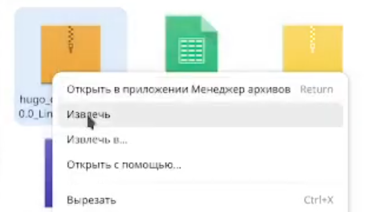
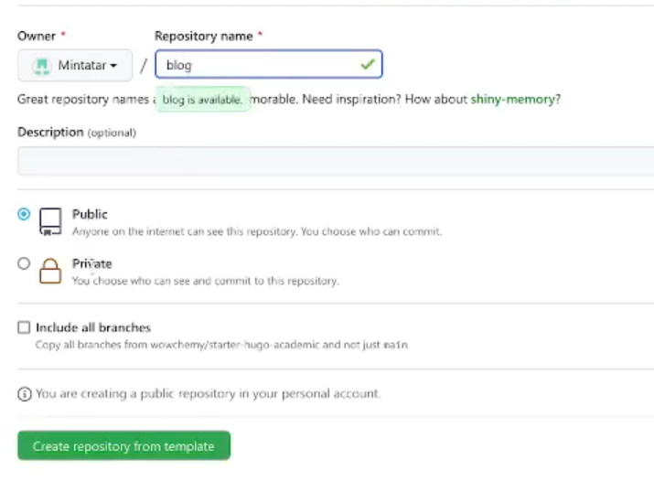
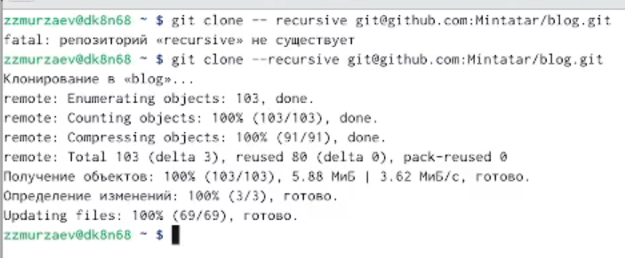
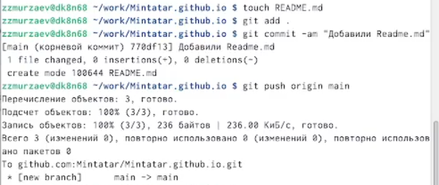
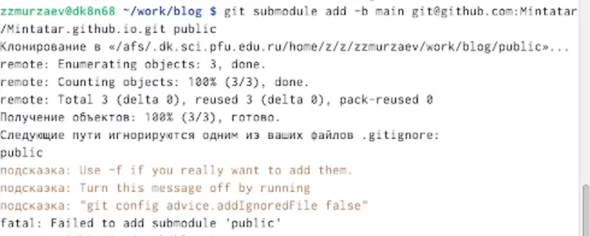
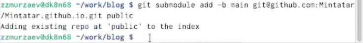
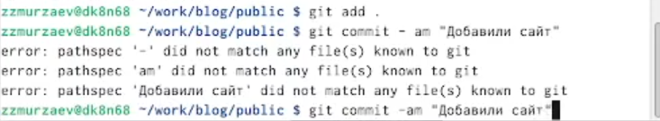
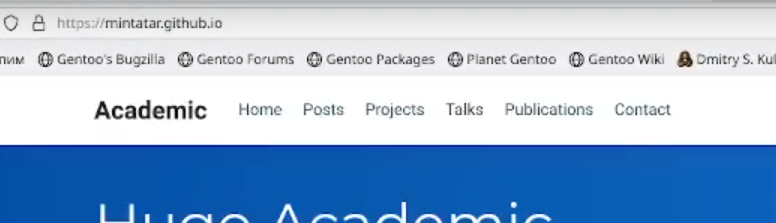

---
## Front matter
title: "Индивидуальный проект"
subtitle: "Первый этап"
author: "Мурзаев Замир Зейнадинович"

## Generic otions
lang: ru-RU
toc-title: "Содержание"

## Bibliography
bibliography: bib/cite.bib
csl: pandoc/csl/gost-r-7-0-5-2008-numeric.csl

## Pdf output format
toc: true # Table of contents
toc-depth: 2
lof: true # List of figures
lot: true # List of tables
fontsize: 12pt
linestretch: 1.5
papersize: a4
documentclass: scrreprt
## I18n polyglossia
polyglossia-lang:
  name: russian
  options:
	- spelling=modern
	- babelshorthands=true
polyglossia-otherlangs:
  name: english
## I18n babel
babel-lang: russian
babel-otherlangs: english
## Fonts
mainfont: PT Serif
romanfont: PT Serif
sansfont: PT Sans
monofont: PT Mono
mainfontoptions: Ligatures=TeX
romanfontoptions: Ligatures=TeX
sansfontoptions: Ligatures=TeX,Scale=MatchLowercase
monofontoptions: Scale=MatchLowercase,Scale=0.9
## Biblatex
biblatex: true
biblio-style: "gost-numeric"
biblatexoptions:
  - parentracker=true
  - backend=biber
  - hyperref=auto
  - language=auto
  - autolang=other*
  - citestyle=gost-numeric
## Pandoc-crossref LaTeX customization
figureTitle: "Рис."
tableTitle: "Таблица"
listingTitle: "Листинг"
lofTitle: "Список иллюстраций"
lotTitle: "Список таблиц"
lolTitle: "Листинги"
## Misc options
indent: true
header-includes:
  - \usepackage{indentfirst}
  - \usepackage{float} # keep figures where there are in the text
  - \floatplacement{figure}{H} # keep figures where there are in the text
---

# Цель работы

Целью данного этапа является размещение на Github pages заготовки для персонального сайта.

# Задание

    1)Установить необходимое программное обеспечение.
    
    2)Скачать шаблон темы сайта.
    
    3)Разместить его на хостинге git.
    
    4)Установить параметр для URLs сайта.
    
    5)Разместить заготовку сайта на Github pages.

# Теоретическое введение

Скачиваем необходимое програмное обеспечения для Линукса из гитхаба и извлекаем.

# Выполнение лабораторной работы

Установил необходимое программное обеспечение(рис. [-@fig:001])

{ #fig:001 width=70% }

Далее перехожу в гитхаб и создаю еще один репозиторий [-@fig:002]

{ #fig:002 width=70% }

Клонируем данный репозиторий [-@fig:003]

{ #fig:003 width=70% }

Переключаюсь на новую ветку [-@fig:004] и ввожу команды git add, git commit -am, git push [-@fig:005]

{ #fig:004 width=70% }

{ #fig:005 width=70% }

Далее клонируем и в папке гитигнор комментируем public и теперь в нашей папке есть файл README.md [-@fig:006] 

{ #fig:006 width=70% }

{ #fig:007 width=70% } 

{ #fig:008 width=70% }

Ввожу команду bin/hugo (извините, забыл запечатлеть)

Теперь, когда каталог подключен к нашему репозиторию и проделываем стандартные действия [-@fig:009]

{ #fig:009 width=70% }

А теперь копирую ссылку из своего гитхаба и вставляю в поисковик [-@fig:010]

{ #fig:010 width=70% }

{ #fig:001 width=70% }

# Выводы

Я начуился создавать простые сайты (а точнее загатовки к сайтам) с помощью сущетсвующих шаблонов.

# Список литературы{.unnumbered}

::: {#refs}
:::
