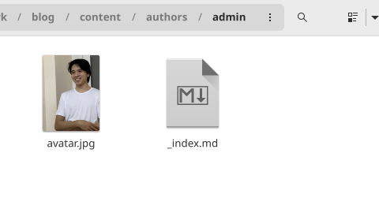
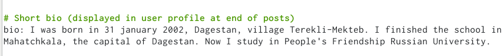

---
## Front matter
lang: ru-RU
title: Структура научной презентации
subtitle: Простейший шаблон
author:
  - Кулябов Д. С.
institute:
  - Российский университет дружбы народов, Москва, Россия
  - Объединённый институт ядерных исследований, Дубна, Россия
date: 01 января 1970

## i18n babel
babel-lang: russian
babel-otherlangs: english

## Formatting pdf
toc: false
toc-title: Содержание
slide_level: 2
aspectratio: 169
section-titles: true
theme: metropolis
header-includes:
 - \metroset{progressbar=frametitle,sectionpage=progressbar,numbering=fraction}
 - '\makeatletter'
 - '\beamer@ignorenonframefalse'
 - '\makeatother'
---

# Информация

## Докладчик

:::::::::::::: {.columns align=center}
::: {.column width="70%"}

  * Мурзаев З.З.
  * студент
  * НБИбд-02-22
  * Российский университет дружбы народов
  * [1132222002@pfur.ru.ru](mailto:kulyabov-ds@rudn.ru)
  * <https://yamadharma.github.io/ru/>

:::
::: {.column width="30%"}


:::
::::::::::::::

# Вводная часть

## Актуальность

- Работа нужна прежде всего для того, чтобы мочь менять свой сайт
- Мы научимся ставить свою фотку
- Начимся писать о себе
- Научимся делать посты на своем сайте

## Объект и предмет исследования

- Сайт
- Маркдоун 
- Посты

## Цели и задачи

- Работа нужна прежде всего для того, чтобы мочь менять свой сайт
- Мы научимся ставить свою фотку
- Начимся писать о себе
- Научимся делать посты на своем сайте

## Материалы и методы

- Процессор `pandoc` для входного формата Markdown
- Результирующие форматы
	- `pdf`
	- `html`
- Автоматизация процесса создания: `Makefile`

# Создание презентации

## Процессор `pandoc`

- Pandoc: преобразователь текстовых файлов
- Сайт: <https://pandoc.org/>
- Репозиторий: <https://github.com/jgm/pandoc>

## Формат `pdf`

- Использование LaTeX
- Пакет для презентации: [beamer](https://ctan.org/pkg/beamer)
- Тема оформления: `metropolis`

## Код для формата `pdf`

```yaml
slide_level: 2
aspectratio: 169
section-titles: true
theme: metropolis
```

## Формат `html`

- Используется фреймворк [reveal.js](https://revealjs.com/)
- Используется [тема](https://revealjs.com/themes/) `beige`

## Код для формата `html`

- Тема задаётся в файле `Makefile`

```make
REVEALJS_THEME = beige 
```
# Выполнение работы


## Получаем ссылку на наш сайт в терминале 

{#fig:001 width=90%}

## Вставляем нашу фотку в сайт 

{#fig:002 width=90%}

## Пишем свою небольшу биографию 

{#fig:003 width=90%}

## Пишем о своих интересах 

{#fig:004 width=90%}

## Пишем об образовании 

{#fig:005 width=90%}

## Так как на прошлой неделе было 8 марта, то я решил сделать пост про этот праздник 

{#fig:006 width=90%}

## Во время записи выполнения лабораторной работы я имел неосторожность удалить случайно свой пост, поэтому во второй раз я сделал пост про вомбата. 

{#fig:007 width=90%}

## Третий пост - про управление версиями git 

{#fig:008 width=90%}

# Выводы

Мы поменяли аватарку на сайте, написали биографию свою, рассказали про свои интересы и образование. Затем написали три поста на разные темы.

