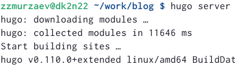
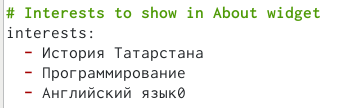
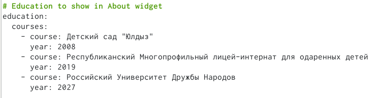
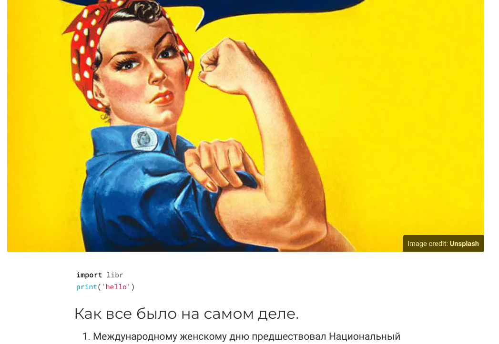
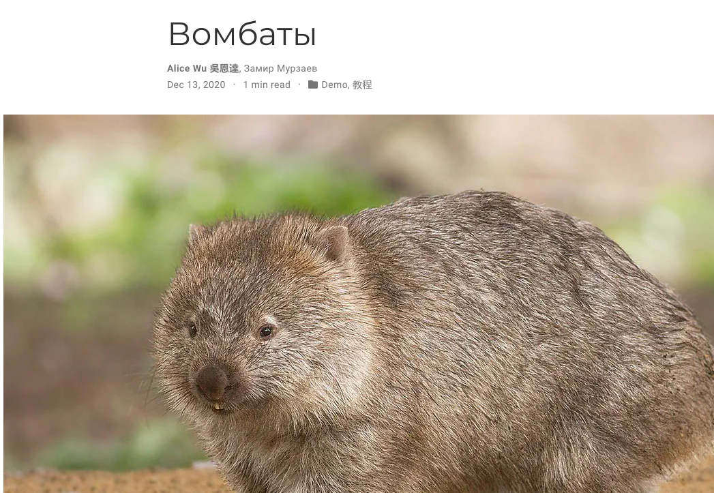

---
## Front matter
title: "Отчет по индивидуальному проекту"
subtitle: "2 этап"
author: "Мурзаев Замир Зейнадинович"

## Generic otions
lang: ru-RU
toc-title: "Содержание"

## Bibliography
bibliography: bib/cite.bib
csl: pandoc/csl/gost-r-7-0-5-2008-numeric.csl

## Pdf output format
toc: true # Table of contents
toc-depth: 2
lof: true # List of figures
lot: true # List of tables
fontsize: 12pt
linestretch: 1.5
papersize: a4
documentclass: scrreprt
## I18n polyglossia
polyglossia-lang:
  name: russian
  options:
	- spelling=modern
	- babelshorthands=true
polyglossia-otherlangs:
  name: english
## I18n babel
babel-lang: russian
babel-otherlangs: english
## Fonts
mainfont: PT Serif
romanfont: PT Serif
sansfont: PT Sans
monofont: PT Mono
mainfontoptions: Ligatures=TeX
romanfontoptions: Ligatures=TeX
sansfontoptions: Ligatures=TeX,Scale=MatchLowercase
monofontoptions: Scale=MatchLowercase,Scale=0.9
## Biblatex
biblatex: true
biblio-style: "gost-numeric"
biblatexoptions:
  - parentracker=true
  - backend=biber
  - hyperref=auto
  - language=auto
  - autolang=other*
  - citestyle=gost-numeric
## Pandoc-crossref LaTeX customization
figureTitle: "Рис."
tableTitle: "Таблица"
listingTitle: "Листинг"
lofTitle: "Список иллюстраций"
lotTitle: "Список таблиц"
lolTitle: "Листинги"
## Misc options
indent: true
header-includes:
  - \usepackage{indentfirst}
  - \usepackage{float} # keep figures where there are in the text
  - \floatplacement{figure}{H} # keep figures where there are in the text
---

# Цель работы

Целью работу является обучение редактированию своего сайт. Мы должны написать минимальную информацию о себе и мочь поменять аватарку. После этого меняем и выкладываем собственные посты на своей странице.

# Задание

    Разместить фотографию владельца сайта.
    Разместить краткое описание владельца сайта (Biography).
    Добавить информацию об интересах (Interests).
    Добавить информацию от образовании (Education).

Сделать пост по прошедшей неделе.
Добавить пост на тему по выбору:

    Управление версиями. Git.
    Непрерывная интеграция и непрерывное развертывание (CI/CD).

# Выполнение второго этапа индивидуального проекта

Получаем ссылку на наш сайт в терминале (рис. @fig:001).

{#fig:001 width=90%}

Вставляем нашу фотку в сайт (рис. @fig:002).

{#fig:002 width=90%}

Пишем свою небольшу биографию (рис. @fig:003).

{#fig:003 width=90%}

Пишем о своих интересах (рис. @fig:004).

{#fig:004 width=90%}

Пишем об образовании (рис. @fig:005).

{#fig:005 width=90%}

Так как на прошлой неделе было 8 марта, то я решил сделать пост про этот праздник (рис. @fig:006).

{#fig:006 width=90%}

Во время записи выполнения лабораторной работы я имел неосторожность удалить случайно свой пост, поэтому во второй раз я сделал пост про вомбата. (рис. @fig:007).

{#fig:007 width=90%}

Третий пост - про управление версиями git (рис. @fig:008).

{#fig:008 width=90%}

# Выводы

Мы поменяли аватарку на сайте, написали биографию свою, рассказали про свои интересы и образование. Затем написали три поста на разные темы.

# Список литературы{.unnumbered}

::: {#refs}
:::
