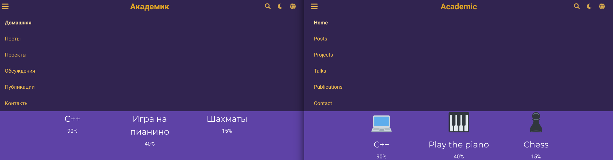
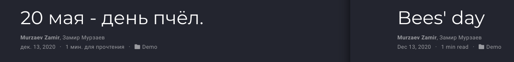

---
## Front matter
lang: ru-RU
title: Структура научной презентации
subtitle: Простейший шаблон
author:
  - Кулябов Д. С.
institute:
  - Российский университет дружбы народов, Москва, Россия
  - Объединённый институт ядерных исследований, Дубна, Россия
date: 01 января 1970

## i18n babel
babel-lang: russian
babel-otherlangs: english

## Formatting pdf
toc: false
toc-title: Содержание
slide_level: 2
aspectratio: 169
section-titles: true
theme: metropolis
header-includes:
 - \metroset{progressbar=frametitle,sectionpage=progressbar,numbering=fraction}
 - '\makeatletter'
 - '\beamer@ignorenonframefalse'
 - '\makeatother'
---

# Информация

## Докладчик

:::::::::::::: {.columns align=center}
::: {.column width="70%"}

  * Мурзаев Замир Зейнадинович
  * д.ф.-м.н., профессор
  * профессор кафедры прикладной информатики и теории вероятностей
  * Российский университет дружбы народов
  * [kulyabov-ds@rudn.ru](mailto:kulyabov-ds@rudn.ru)
  * <https://yamadharma.github.io/ru/>

:::
::: {.column width="30%"}

:::
::::::::::::::

# Цель работы

Цель работы - размещение двуязычного сайта на Github.

# Задание

    Сделать поддержку английского и русского языков.
    Разместить элементы сайта на обоих языках.
    Разместить контент на обоих языках.
    Сделать пост по прошедшей неделе.
    Добавить пост на тему по выбору (на двух языках).
    
# Выполнение лабораторной работы

## 1)Делаем поддержку английского и русского языков 

{#fig:001 width=90%}

## 2)Размещаем элементы сайта на обоих языках 

{#fig:002 width=90%}

## Размещаем контент на обоих языках 

{#fig:003 width=90%}

## Делаем пост по прошедшей неделе

{#fig:004 width=90%}

# Выводы

Разместили двуязычный сайт на Гитхаб.

# Список литературы{.unnumbered}

::: {#refs}
:::

